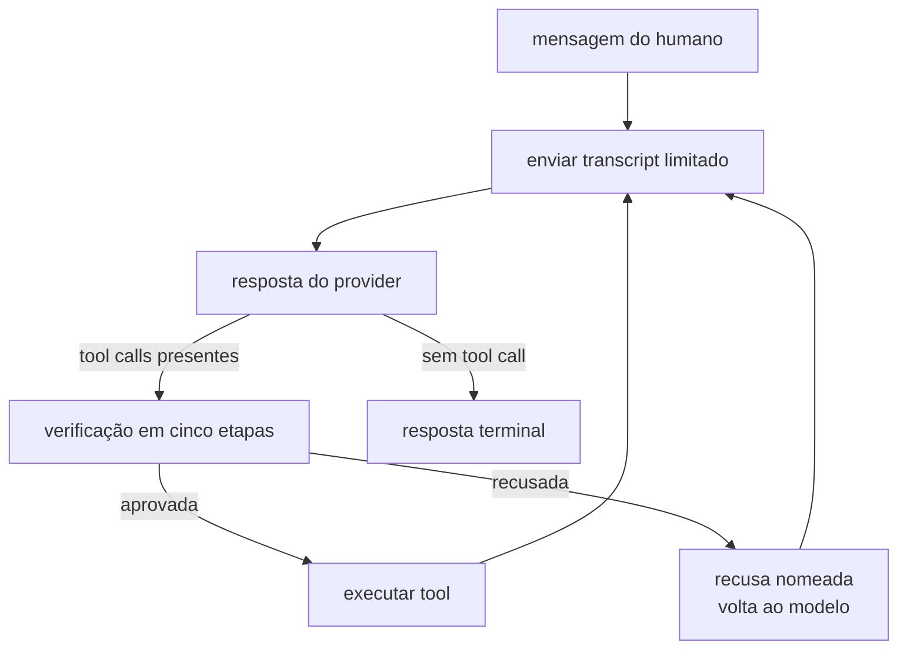

# Loop, budgets e terminais do Lab Agent v1

Este contrato declara como um turno do Lab Agent progride, o que é verificado antes de qualquer
efeito, quais budgets existem e como um turno termina. Está aceito e ainda não possui runtime.

Quais tools existem pertence ao [catálogo v1](lab-agent-tools-v1.md). Códigos de recusa pertencem aos
[erros v1](lab-agent-errors-v1.md). Sessões e escopo pertencem ao [escopo v1](lab-agent-scope-v1.md).

## Vocabulário

**Turno** é uma mensagem do humano e todo o trabalho do agente até uma resposta terminal ou um
terminal de budget. Um turno pode conter várias idas ao provider e várias tool calls.

**Round-trip** é uma ida ao provider e sua resposta. Um turno com três tool calls sequenciais tem no
mínimo quatro round-trips.

Turno do Lab Agent não é turno do Subject. `subject.responded` conta turnos de uma Run; nada neste
contrato produz evento de Run.

## O laço

O laço tem exatamente três decisões: enviar, servir tool calls, ou aceitar o terminal. Recusa não
interrompe o turno; ela volta ao modelo como resultado da tool call, para que o modelo corrija.

O transcript é reenviado explicitamente a cada round-trip. O provider default roda Responses não
persistente, portanto estado de servidor por `previous_response_id` não é assumido.

## Verificação antes do efeito

Toda tool call atravessa cinco etapas, nesta ordem, e cada uma recusa antes de a seguinte rodar:

| Ordem | Etapa | Recusa quando |
| --- | --- | --- |
| 1 | catálogo | a tool não está no catálogo efetivo da forma de sessão |
| 2 | budget | o teto de tool calls do turno já foi alcançado |
| 3 | schema | o conjunto de chaves não é exatamente o declarado, ou um tipo divergir |
| 4 | scope | uma ref não resolve dentro do Workspace/Project da sessão |
| 5 | classification | o conteúdo é `sensitive` ou `restricted` sem grant para o Lab Agent |

A ordem é normativa e cada posição tem uma razão.

Catálogo antes de budget, porque consumir orçamento com uma tool inexistente puniria o humano por um
erro do modelo. Budget antes de schema, porque o teto é sobre tentativas e não sobre tentativas bem
formadas. Schema antes de scope, porque uma ref só pode ser resolvida depois de existir como campo
válido. Scope antes de classification, porque negar por classificação um alvo de outro Project
revelaria que ele existe.

A verificação de budget acontece **antes** de a tool executar. A negação é registrada no rastro antes
de o terminal ser levantado; a ordem inversa perderia o registro da tentativa que estourou o teto.

## Budgets

| Budget | Escopo | Excedido produz |
| --- | --- | --- |
| `max_tool_calls_per_turn` | um turno | terminal `budget_exhausted` |
| `max_provider_round_trips_per_turn` | um turno | terminal `budget_exhausted` |
| `max_wall_seconds_per_turn` | um turno | terminal `budget_exhausted` |
| `max_refusals_per_turn` | um turno | terminal `budget_exhausted` |
| `max_output_tokens_per_round_trip` | um round-trip | truncamento do transporte, não terminal |

Todo budget é aplicado antes de ser anunciado. Um teto declarado que o runtime não verifica é uma
promessa falsa, e o produto recusa a sessão em vez de anunciá-lo.

Budgets são do turno, não da sessão. Uma sessão longa não fica progressivamente mais restrita; cada
mensagem do humano recomeça a contagem. Isso mantém a conversa utilizável sem afrouxar o limite de
trabalho por pedido.

`max_refusals_per_turn` existe porque recusa não consome `max_tool_calls_per_turn`: uma tool call
recusada na etapa 1 nunca executou. Sem um teto próprio, um modelo confuso poderia alternar entre
recusas indefinidamente.

## Repetição exata é terminal

Duas tool calls idênticas no mesmo turno — mesma tool, mesmos argumentos, mesmo código de recusa —
encerram o turno com terminal `repeated_refusal`.

Identidade é por digest canônico dos argumentos mais nome da tool mais código do resultado. Argumento
diferente não é repetição, mesmo que a intenção pareça a mesma: o produto não adivinha intenção.

Esta regra substitui detecção heurística de laço. Similaridade entre tentativas produziria um limite
que ninguém consegue declarar nem testar; igualdade exata é legível, determinística e cobre o modo de
falha real, que é o modelo reenviar a mesma chamada esperando resultado diferente.

Recusa repetida é sinal de defeito do produto, não de teimosia do modelo. A correção pertence à
composição de instruções e à descrição do catálogo, não a tolerância maior no runtime.

## Terminais

| Terminal | Significado | Resposta ao humano |
| --- | --- | --- |
| `answered` | o modelo respondeu sem pedir mais tool calls | conteúdo da resposta |
| `proposed` | o turno terminou com um draft registrado | draft mais refs lidas |
| `budget_exhausted` | um teto do turno foi alcançado | o que foi feito até ali, mais o teto atingido |
| `repeated_refusal` | a mesma tool call recusada foi repetida | a recusa e sua remediação |
| `provider_failed` | o provider não devolveu resposta utilizável | falha sanitizada, sem detalhe interno |
| `cancelled` | o humano cancelou o turno | trabalho parcial declarado como parcial |

Todo terminal é observável e nomeado. Um turno nunca termina em silêncio, e um turno interrompido
nunca é apresentado como completo.

`answered` e `proposed` são separados porque a UI precisa distinguir explicação de proposta. Um draft
registrado exige apresentação diferente: ele é draft, não fato, e tem um caminho humano de aceitação.

## Cancelamento

O humano cancela um turno em andamento. O cancelamento interrompe o laço na próxima fronteira segura:
depois de uma tool executar e ser registrada, nunca no meio de uma escrita.

Um draft já registrado por `propose_draft` permanece registrado após cancelamento. Ele é `draft` sem
decisão, portanto não há estado inconsistente a desfazer, e apagá-lo esconderia trabalho que o humano
pediu.

## Eventos de interface

O turno emite eventos de progresso para a UI: mudança de status, tool começando e terminando com
resumo de argumento e resultado, mensagem, erro e terminal. Esses eventos são de apresentação e não
são Events de Run.

Ver a tool executando é requisito e não conforto: o ADR 0018 exige que o humano possa ver o que o
agente leu, e um stream que só emite a resposta final torna isso impossível.

## O que este contrato prova e não prova

Prova que todo efeito de tool é precedido por cinco verificações em ordem fixa, que todo budget
anunciado é verificado antes do efeito, que todo turno termina em um terminal nomeado, e que repetição
exata de recusa não produz laço.

Não prova que a resposta do agente é correta, que a proposta é boa, nem que o modelo cooperou com as
instruções. Qualidade de resposta não é invariante de runtime: ela pertence a avaliação, e um Study
que meça isso é trabalho próprio.

## Provas mínimas

- budget de tool calls verificado antes da execução, com a negação registrada antes do terminal;
- as cinco etapas recusam na ordem declarada, cada uma com seu código;
- tool fora do catálogo não consome `max_tool_calls_per_turn`;
- `max_refusals_per_turn` encerra um turno que só produz recusas;
- tool call idêntica repetida produz `repeated_refusal` e não um terceiro round-trip;
- argumento diferente não conta como repetição;
- cada terminal é observável e distinguível dos demais;
- cancelamento interrompe em fronteira segura e preserva draft já registrado;
- turno parcial nunca é apresentado como completo;
- nenhum caminho do loop emite Event de Run.
