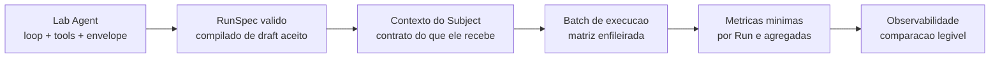

# Minimo Confortavel

## O que este documento e

O corte de escopo que o produto precisa atravessar antes de qualquer largura adicional. Ele nao
adiciona capability normativa nova: ele nomeia o corredor que torna o laboratorio utilizavel por uma
pessoa, e a ordem em que suas partes se destravam.

Este documento e planejamento. Nao promove capability, nao substitui ADR nem contract, e cada item
so muda de estado com referencia de implementacao e verificacao.

## O corredor

A persistencia nao e uma etapa do corredor: ela e transversal e ja existe. Runs, eventos, envelopes,
evaluations e bundles sao persistidos hoje pelo Runtime Kernel, com hash chain e verificacao de
bundle. O que falta e o que entra e o que sai dessa persistencia.

## As seis partes

### 1. Lab Agent como agente

Loop de tools, contexto declarado e conversa com estado. Escopo em
[ADR 0018](../adr/0018-lab-agent-copilot-scope.md).

Minimo: o agente conversa, le contracts e evidencia autorizada por tool, propoe drafts tipados e
explica o que propos. Ele opera as superficies publicas existentes, sem autoridade adicional.

Fora do minimo: bounded exploration, nested agents, efeitos externos, aprovacao automatica.

**Memoria operacional e adjacente, nao parte do corredor.** O
[ADR 0019](../adr/0019-lab-agent-operational-memory.md) define memoria por Workspace com descoberta
por cue e promocao humana, entregue por [WS-07](tasks/07-lab-agent-memory.md). Ela melhora a
qualidade dos drafts, mas o corredor fecha sem ela, e seu proprio ganho e hipotese ate ser medido.
A obrigacao que WS-04 herda e apenas nao fechar a porta: loop extensivel por capability e
`informed_by` declarado no draft desde o inicio.

### 2. Criacao de um experimento que compila

Um draft proposto pelo Lab Agent, aceito pelo humano, tem que atravessar
`StudyRevision -> compile -> RunSpec -> admit` sem erro. Hoje `StudyCompiler.compile` ja produz a
matriz completa (`variants x repetitions`); o que falta e um caminho de autoria que chegue ate ele
sem fixture legada.

Minimo: existir Workspace e Project criaveis, existir aceitacao de revision que nao minta sobre
autoridade humana, e a pagina Create deixar de executar a fixture `CRL-CTX-002` em vez do que foi
digitado.

Isso depende de WS-01 (superficie de Workspace/Project) e WS-03 (decisao de autoria default).

### 3. Contexto e criterios do Subject

Aqui existe trabalho de contrato ainda nao feito, e ele e o mais delicado do corte.

O `SubjectEnvelope` e uma allowlist fechada e ja compila Goal, inputs visiveis, protocolo visivel,
capabilities admitidas, workspace, budgets e stop conditions. O que nao existe e o vocabulario de
autoria que descreve **de onde vem** o contexto de um experimento real: material de referencia,
estado inicial, arquivos, instrucoes de cenario e o que distingue duas variants alem de um override
de texto.

Sem isso, o cenario canonico do produto — "Plano antes de implementar versus implementacao direta,
mesmo contexto" — nao e expressavel: as duas variants nao tem como diferir de forma tipada e
auditavel na dimensao que importa.

Minimo: um contrato de contexto de Scenario suficiente para expressar uma comparacao de variavel
primaria unica, com o mesmo material entregue a ambas as variants, e o `Context Snapshot`
correspondente registrado no ledger. `ArtifactRef` continua sem locator; o envelope continua
allowlist fechada; campo novo de RunSpec continua nao entrando no envelope automaticamente.

Fora do minimo: montagem dinamica de contexto, context mounts de sessoes anteriores, compaction e
Context Diff em UI.

### 4. Batch de execucao

A matriz ja e compilada; o que falta e executa-la como lote.

Minimo: enfileirar todos os RunSpecs de um Study numa operacao, acompanhar progresso agregado do
lote, cancelar o lote, e sobreviver a falha parcial sem perder as Runs que terminaram. Concorrencia
configuravel, porque o limite real e o provider, nao a maquina.

Isso exige o worker rodando no app instalado (WS-02) e a camada de provider preparada para volume:
retry com backoff, respeito a rate limit e falha que nao contamina o lote inteiro.

Fora do minimo: fila distribuida, execucao remota, agendamento.

### 5. Metricas minimas

O ponto de partida ja existe e nao esta documentado como tal: `subject.responded` grava
`input_tokens`, `output_tokens` e `tool_calls` em `metadata`
(`src/evidrun/runs/adapters/subject_responses.py`). Wall time e derivavel dos timestamps do ledger.

Minimo, por Run: tokens de entrada e saida, contagem de tool calls, duracao, terminal cause e o
vetor do EvaluationRecord.

Minimo, agregado sobre repeticoes: taxa de sucesso por variant, `pass@k` e `pass^k`, e a diferenca
entre variants com indicacao de incerteza. `pass@k` e a probabilidade de ao menos um acerto em k
tentativas; `pass^k` e a probabilidade de acertar todas as k. Os dois divergem com k e medem coisas
diferentes: potencial e confiabilidade. Nenhum deles existe sem repeticoes.

Custo entra aqui como projecao derivada de tokens e de uma tabela de preco por modelo, nao como
budget aplicado: hoje `max_cost` e rejeitado na admissao (`contracts/admission/checks/`
`unsupported.py`) e continuara rejeitado enquanto nao houver enforcement real.

A agregacao e um read model derivado. O ledger permanece a autoridade; a projecao e descartavel e
reconstruivel. Nao agregue consultando o ledger em varredura.

Fora do minimo: significancia estatistica formal, deteccao de saturacao, judges calibrados.

### 6. Observabilidade da comparacao

A pagina Observability ja consome endpoints reais por Run. O que falta e a leitura do experimento:
duas ou mais variants lado a lado, com as metricas agregadas e o caminho para o transcript de
qualquer Run individual.

Minimo: ver o lote, ver a comparacao agregada, e abrir a Run que explica um numero. Ler transcripts
e a atividade que valida se a metrica mede o que se pensa que mede; sem esse caminho, o resto e
decoracao.

Fora do minimo: Canvas, grafo semantico, replay.

## Tensao conhecida deste corte

O produto rejeita hoje, na admissao: `max_turns > 1`, grafo de interacao, mais de um stage de
evaluation, budgets de token e custo, `checkpoint_policy`, progress policy e todo disclosure
diferente de `none`. Cada rejeicao e honesta e cada uma existe porque o coordinator correspondente
nao existe.

A consequencia e que o cenario que motiva o produto ainda nao roda: comparar "com plano" e "sem
plano" com tools e mais de um turno exige multi-turn admitido. Promover essa capability exige o
coordinator de turnos com budget realmente aplicado — nao afrouxar o check.

Isso e escopo desta lista, nao dividendo dela: sem multi-turn, o Minimo Confortavel entrega o
corredor e nao entrega o experimento que o justifica.

## Fora do Minimo Confortavel

Artifact grants e materialization records; evaluation generica com multiplos stages e judge
calibrado; checkpoint e progress coordinators; bounded exploration; runtime generico de tools,
skills e nested agents; bundle portatil, restore, replay e fork; Canvas; DuckDB/Parquet; packaging
assinado; sync, cloud e multi-tenant.
