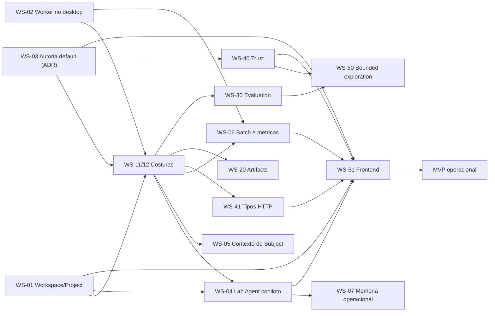

# Roadmap executavel do MVP

## Resultado de produto

O MVP nao exige Canvas, nested agents ou replay. Ele exige que um usuario consiga, pelo aplicativo
local, transformar uma hipotese em uma Run auditavel sem editar o banco ou chamar scripts internos.

## O que ja atravessa o pipeline

O corredor canonico foi exercitado ponta a ponta em `main` usando somente superficies publicas:

```text
contract register -> authority accept -> study compile -> run admit -> run enqueue
  -> worker --once -> run.completed -> bundle export -> bundle verify
```

O ledger emitiu a sequencia completa (`run.queued`, `run.preparing`, `context.composed`,
`run.running`, `subject.invoked`, `subject.responded`, `run.evaluating`, `evaluation.completed`,
`run.completed`) e o Bundle v3 verificou todos os grupos de records.

Isso significa que o problema do MVP **nao e** a espinha de execucao. A espinha existe e e auditavel.
O problema e que ela esta inalcancavel para um usuario e estreita demais para um Study real.

## Os tres bloqueios que impedem uso

Estes bloqueios foram reproduzidos, nao inferidos. Nenhum deles e uma capability nova: sao lacunas de
superficie e de lifecycle em cima de dominio que ja funciona.

| # | Bloqueio | Evidencia observada |
| --- | --- | --- |
| B1 | Nao existe como criar Workspace ou Project | Banco novo tem zero Projects. Writes internos existem no `CatalogStore`, mas sem nome canonico/unicidade; nao ha comando CLI nem rota `POST`. O erro `register.project_not_found` ja foi tipado, porem ainda falta criar o Project por superficie publica. O unico bootstrap completo continua sendo `evidrun demo`. |
| B2 | O desktop empacotado nunca processa Runs | `backend-lifecycle.ts` faz spawn de `evidrun serve --desktop-handshake`; `serve` sobe apenas uvicorn. Nenhum path do produto inicia `evidrun-worker`. A UI enfileira Runs que ninguem executa. |
| B3 | Autoria verificada e opt-in e desligada por padrao | `Settings.authority_enabled` default `False`. Sem `EVIDRUN_AUTHORITY=1`, `StudyCompiler.resolve` recusa toda revision, porque `decide` exige verifier confiavel. Por padrao o unico corredor que aceita revisions e o `repository_fixture` nao humano. |

Corrigido neste ciclo, pela mesma investigacao: a CLI reconstruia `Repository` sem verifier, entao
gravava aceitacao verificada que ela mesma nao conseguia reler; `authority accept` sobrescrevia o
verifier ignorando o gate do ADR 0015; e `contract accept` era um stub morto que duplicava
`authority accept`.

## Por que esta ordem

A ordem nao segue a numeracao dos workstreams. Ela segue duas perguntas: *o que torna o produto
utilizavel* e *o que precisa existir antes de varias frentes poderem editar em paralelo*.

1. **Espinha alcancavel primeiro.** Enquanto B1/B2/B3 existem, qualquer capability nova nasce
   inalcancavel. Uma feature que so pode ser exercitada por teste de integracao nao e entrega de
   produto. Estes tres itens sao pequenos, independentes entre si e desbloqueiam todo o resto.
2. **Costuras antes da largura.** Tres arquivos concentravam o que WS-20, WS-30 e WS-40 precisam
   editar: `Repository`, `AdmissionService.admit` e `RuntimeAdapterCatalog.validate_spec`, que
   duplicava parte da decisao de admissao. Toda capability nova exigia um `if` novo na mesma funcao e
   um metodo novo na mesma classe. As duas costuras foram abertas na Onda 1: hoje uma capability nova
   nasce em `contracts/admission/checks/` mais o envelope do catalogo, e uma escrita nova nasce no
   agregado dono da sua atomicidade.
3. **Largura depois.** Com superficie utilizavel e costuras abertas, as frentes de evidencia,
   artifacts e confianca sao genuinamente independentes e podem correr juntas.
4. **Frontend por ultimo, por dependencia real.** A pagina Observability ja consome endpoints reais.
   O wizard de Create so pode deixar de ser rascunho local quando existir criacao de Project e um
   caminho de aceitacao usavel. Laboratory so deixa de ser mock quando o Lab Agent existir. Integrar
   UI antes disso produz tela que mente.

## Ondas de execucao

### Onda 0 — espinha alcancavel

Tres fatias independentes, sem arquivo compartilhado entre elas. Executam em paralelo.

- **WS-01 Superficie de Workspace/Project:** dois tracer bullets verticais (Workspace, depois
  Project), com nome canonico, migration/constraints, `ScopeError`, leituras diretas, rotas e CLI.
  Resolve B1 sem criar Run Environment.
- **WS-02 Lifecycle do worker no desktop:** o app local passa a supervisionar execucao, nao apenas a
  API. Resolve B2. Inclui reinicio observavel e o gate de CI que hoje nao roda (`test:handshake`).
- **WS-03 Decisao de autoria default:** ADR sucessor que define como um usuario aceita uma revision
  no produto instalado, sem afirmar falsa autoridade humana. Resolve B3 e fixa o contrato que a
  WS-40 vai implementar.

WS-03 e decisao, nao codigo: ela precisa aterrissar antes da Onda 2 porque define o vocabulario de
trust que WS-40 e o frontend consomem.

### Onda 1 — costuras do dominio (entregue)

Serial e inline por natureza: e exatamente o trabalho que todos os demais consomem. Aterrissou em
`812b330` (PR #20) e `62ddec8` (PR #21).

- **WS-11 Fatiar `Repository` por agregado:** entregue. `repository.py` tem 53 linhas e e raiz de
  composicao sobre nove agregados que compartilham um `UnitOfWork`. Ledger, fila/lease, contract
  registry, evaluation/checkpoint, catalog e read-model sao colaboradores separados. A atomicidade de
  `claim_next_job` e `prepare_run_execution` foi medida contra o commit base e nao mudou.
- **WS-12 Registro de checkers de admissao:** entregue. `admit` virou orquestracao de checkers puros
  `(spec, envelope) -> findings` em `contracts/admission/`, e `validate_spec` foi nomeada como segunda
  camada em `runs/admission/`. O envelope virou objeto explicito produzido apenas pelo catalogo.

Criterio de saida cumprido: nenhuma mudanca de comportamento observavel, suite completa verde, e a
mesma decisao de admissao para os mesmos specs — travada por um oraculo de equivalencia de 62 casos
que compara decisao, statuses, requisitos, politicas negadas e a mensagem exata de cada issue byte a
byte. Um defeito latente encontrado ao exercitar o ramo de provider indisponivel pela primeira vez foi
escalado e corrigido: `admit` levantava `ValidationError` em vez de devolver `decision=rejected`.

### Onda 2 — Minimo Confortavel

O corte que torna o laboratorio utilizavel, definido em
[Minimo Confortavel](comfortable-minimum.md). O [ADR 0018](../adr/0018-lab-agent-copilot-scope.md)
separou o copiloto do bounded exploration, e por isso WS-04 nao depende mais de WS-20/30/40.

- **WS-04 Runtime do Lab Agent copiloto:** um unico runtime, sessoes General/Project/Focused,
  `LabAgentEnvelope`, scope imposto por tool, proposta de draft sem decisao, endpoints e streaming.
  Depende de WS-01.
- **WS-05 Contexto e criterios do Subject:** contrato de contexto de Scenario suficiente para uma
  comparacao de variavel primaria unica, com material identico por digest entre variants irmas.
- **WS-06 Batch, resiliencia de provider e metricas minimas:** lote de execucao, retry/backoff e
  rate limiting, metricas por Run e agregacao `pass@k`/`pass^k` como read model. Depende de WS-02.
- **WS-07 Memoria operacional e consolidador:** `MemoryEntry` v2 com Workspace hard boundary,
  Project opcional, FTS5 sobre cues, tools de busca/leitura, consolidador e promocao humana. Depende
  de WS-04.
- **WS-41 Contratos tipados de HTTP:** os DTOs de resposta consumidos pelo frontend passam pelo
  gerador, fechando o drift entre `apps/web/src/types.ts` e os schemas reais.

### Onda 3 — largura de evidencia

Paralelo amplo. Cada frente tem ownership de arquivo distinto depois das costuras.

- **WS-20 Artifact access e capture:** grants, materialization records e enforcement de capture.
- **WS-30 Evaluation executavel:** multiplos stages, model judge, CheckpointCoordinator e
  ProgressObserver.
- **WS-40 Trust de execucao nao verificada e ReviewPackage:** implementa a decisao da WS-03 sem
  confundir trust com Run Environment ou prometer sandbox forte.

### Onda 4 — laboratorio autonomo

- **WS-50 Bounded exploration e multi-turn:** coordinator de turnos com budget aplicado e terminal em
  dois eixos. Depende de WS-30 e WS-40.
- **WS-51 Integracao do frontend:** Workspace switcher e Project Room passam a usar entidades reais;
  Laboratory consome o unico Lab Agent no scope correto; Create configura Run Environment no
  documento versionado; a UI separa trust, `in_process`, capability e lifecycle.
### Onda 5 — fechamento

Dossiers determinístico, com modelo real e bounded; fluxo nao verificado e fluxo verificado; E2E web +
sidecar + worker; threat review e recovery; documentacao atualizada somente depois da evidencia.

## Grafo de dependencias



## Workstreams e cortes

| ID | Workstream | Dependencias | Paralelo com | Nao inclui |
| --- | --- | --- | --- | --- |
| WS-01 | Superficie de Workspace/Project | nenhuma | WS-02, WS-03 | Lab Agent, Run Environment, autoria assistida, importacao em massa |
| WS-02 | Lifecycle do worker no desktop | nenhuma | WS-01, WS-03 | packaging assinado, distribuicao publica |
| WS-03 | Decisao de autoria default | nenhuma | WS-01, WS-02 | implementacao de trust/isolamento (e WS-40) |
| WS-11 | Fatiar `Repository` | Onda 0 | serial | mudanca de comportamento |
| WS-12 | Registro de checkers de admissao | WS-11 | serial | promover capability rejeitada |
| WS-13 | Costuras das paginas web | nenhuma | WS-11, WS-12 | mudanca observavel de UI |
| WS-04 | Runtime do Lab Agent copiloto | WS-01 + costuras | WS-05, WS-06, WS-41 | bounded exploration, multi-turn, efeitos externos |
| WS-05 | Contexto e criterios do Subject | costuras | WS-04, WS-06 | context mounts, compaction, Context Diff em UI |
| WS-06 | Batch, provider e metricas minimas | WS-02 + costuras | WS-04, WS-05 | estatistica formal, budget de custo aplicado |
| WS-07 | Memoria operacional e consolidador | WS-04 | WS-05, WS-06, WS-41 | memoria global/cross-Project, memoria como evidencia, inferencia de relacao em runtime |
| WS-41 | Contratos tipados de HTTP | costuras | WS-04, WS-05, WS-06 | redesenho de API |
| WS-20 | Artifact access/capture | costuras | WS-30, WS-40 | portable bundle, restricted data |
| WS-30 | Evaluation/checkpoint/progress | costuras | WS-20, WS-40 | restore, replay, fork |
| WS-40 | Trust nao verificado/ReviewPackage | WS-03 + costuras | WS-20, WS-30 | sandbox de OS, falsa aceitacao humana |
| WS-50 | Bounded exploration e multi-turn | WS-30 + WS-40 | WS-51 parcial | nested agents, efeitos externos, copiloto (WS-04) |
| WS-51 | Integracao do frontend | WS-01 + WS-03 + WS-04 + WS-06 + WS-40 + WS-41 | — | Canvas, replay, agente por Project |

## Gates entre ondas

Uma onda nao e promovida porque os arquivos existem. O gate exige:

1. branch atualizada com `origin/main`;
2. migrations lineares testadas em banco vazio e banco legado;
3. testes adversariais para bypasses de authority, envelope e ledger;
4. schemas/OpenAPI/TypeScript sem drift;
5. suite obrigatoria do `AGENTS.md` no commit final;
6. review read-only independente para P0/P1;
7. docs sem prometer capability ausente;
8. PR com escopo, limites e evidencia de verificacao.

## Backlog pos-MVP

Ficam fora do corte operacional inicial: runtime generico de tools e skills com approval gateway;
graph protocol e nested agents; restore, replay e fork por checkpoint; bundle portatil com blobs;
Canvas semantico; repeticoes e estatistica em escala; DuckDB/Parquet; packaging e notarizacao para
distribuicao publica; sync, cloud e multi-tenant.
