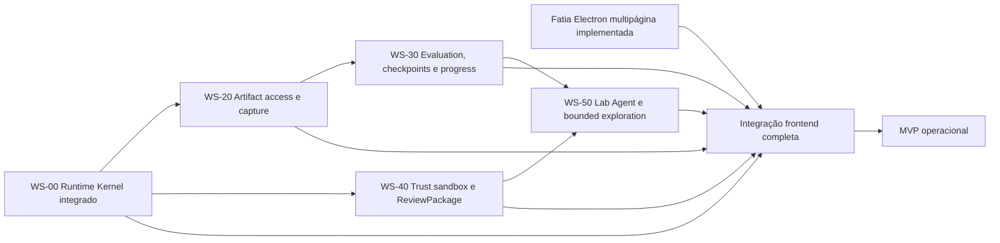

# Roadmap executavel do MVP

## Resultado de produto

O MVP nao exige Canvas, nested agents ou replay. Ele exige que um usuario consiga, pelo aplicativo
local, transformar uma hipotese em uma Run auditavel sem editar o banco ou chamar scripts internos.

O fluxo de saida e:

```text
projeto + artifacts
-> drafts de Study e modulos
-> sandbox explicito ou pacote humanamente aceito
-> compile
-> admit
-> enqueue
-> worker
-> Subject deterministico ou modelo real
-> evaluation
-> checkpoint/progress quando configurados
-> terminal
-> inspecao no frontend
-> bundle auditavel verificado
```

## Definicao de backend funcional

O backend do MVP esta funcional somente quando:

- um Study novo, nao legado, atravessa autoria, compilacao, admissao, fila, worker e terminal;
- existe um caminho rapido `unverified_sandbox` que nao afirma autoridade humana;
- existe um caminho verificado usando a authority opt-in ja implementada;
- o Subject real recebe e usa apenas o `SubjectEnvelope` persistido;
- artifacts possuem identidade, autorizacao de audiencia e materializacao auditavel;
- capture/classification sao impostas nas escritas reais do runtime;
- um EvaluationPlan com mais de um stage deterministico e opcional model judge pode executar;
- checkpoints e Progress Artifacts sao produzidos automaticamente quando a policy os solicitar;
- bounded exploration termina por disposition/stop reason, nunca por pass/fail inventado;
- falhas, timeout, lease expiry, retry e restart convergem sem duplicar fatos;
- o bundle exportado verifica contratos, envelopes, events, evaluations, checkpoints e manifest;
- API e CLI usam o mesmo dominio e nao possuem atalhos de autoridade.

## Definicao de frontend trabalhavel

O frontend esta trabalhavel quando um usuario consegue:

- criar/selecionar projeto;
- importar ou editar documentos de contract em formulario/JSON assistido;
- validar, registrar e comparar revisions;
- escolher sandbox ou abrir confirmacao humana quando aplicavel;
- compilar e ver o tamanho da matriz antes de executar;
- inspecionar admission issues sem ler JSON bruto;
- enfileirar e acompanhar Run/job/attempt em tempo real;
- navegar pelo ledger, SubjectEnvelope digest, tool events, evaluations e artifacts permitidos;
- ver checkpoints e Progress Artifacts sem confundi-los com fatos canonicos;
- exportar/verificar bundle;
- distinguir claramente `mock`, `sandbox`, `verified`, `rejected`, `failed` e `unsupported`.

Uma UI bonita que apenas chama `/demo/bootstrap` nao satisfaz esse criterio.

## Grafo de dependencias



## Ondas de execucao

### Onda 0 — concluida em `main`

- **WS-00:** Runtime Kernel, Subject real e read tool foram integrados pela PR #4.
- **UI/UX:** a direção anterior e os protótipos descartados continuam históricos. Uma nova fatia
  multipágina foi implementada em `task/electron-frontend`, usando referências selecionadas do
  AIDesigner sem promover suas fixtures a fatos do produto. Laboratory continua Demo; Create só
  conecta o bootstrap canônico; Observability consome os endpoints atuais.

### Onda 1 — fronteira de dados e confianca

Com o Kernel em `main`, duas worktrees podem avancar com ownership separado:

- **WS-20:** grants/materializacao/capture no backend e ArtifactStore;
- **WS-40:** successor ADR, Sandbox Run e ReviewPackage no Control Plane.

Essas branches nao devem editar a mesma migration. A primeira a entrar define o proximo head; a
segunda rebaseia e cria sua migration depois.

### Onda 2 — Evidence Plane executavel

- **WS-30:** executor de EvaluationPlan, CheckpointCoordinator e ProgressObserver.

Esse trabalho depende dos artifacts autorizados de WS-20 e do lifecycle duravel de WS-00. Deve ser
uma unica linha de integracao porque evaluations, checkpoints e progress compartilham boundaries,
terminal coverage e Bundle verifier.

### Onda 3 — laboratorio util

- **WS-50:** Lab Agent limitado a drafts/requests e runtime de bounded exploration;
- a Console Web integra authoring, approval, monitoramento e evidence views reais.

Lab Agent nao recebe autoridade humana, nao altera Run terminal e nao usa chats como evidencia do
Subject.

### Onda 4 — fechamento do MVP

- um dossier deterministico offline;
- um dossier com modelo real e read tool;
- uma investigacao bounded com checkpoint e Progress Artifact;
- um fluxo sandbox sem attestation humana;
- um fluxo verificado com attestation;
- testes E2E web + sidecar + worker;
- threat review, recovery de banco e bundle verification;
- documentacao atualizada somente depois de evidencia executavel.

## Workstreams e cortes

| ID | Workstream | Dependencias | Pode rodar em paralelo | Nao inclui |
| --- | --- | --- | --- | --- |
| WS-00 | Runtime Kernel integration | authority em `main` | encerrado | generic skills, graph, replay |
| WS-10 | Fatia multipágina do frontend Electron | referências selecionadas e boundaries atuais | WS-20, WS-30, WS-40 e WS-50 | Lab Agent real, autoria canônica completa, artifact access, authority no renderer ou replay |
| WS-20 | Artifact access/capture | WS-00 | WS-40 | portable bundle, restricted data |
| WS-30 | Evaluation/checkpoint/progress | WS-00 + WS-20 | frontend adapters | restore, replay, fork |
| WS-40 | Trust sandbox/ReviewPackage | authority + WS-00 | WS-20 | falsa aceitacao humana |
| WS-50 | Lab Agent/bounded exploration | WS-30 + WS-40 | frontend integration | nested agents, external effects |

## Gates entre ondas

Uma onda nao e promovida porque os arquivos existem. O gate exige:

1. branch atualizada com `origin/main`;
2. migrations lineares testadas em banco vazio e banco legado;
3. testes adversariais para bypasses de authority, envelope e ledger;
4. schemas/OpenAPI/TypeScript sem drift;
5. suite obrigatoria do `AGENTS.md` no commit final;
6. review read-only independente para P0/P1;
7. docs sem prometer capability ausente;
8. PR com escopo, limites e evidencia de verificacao.

## Backlog pos-MVP

Ficam fora do corte operacional inicial:

- runtime generico de tools e skills com approval gateway;
- graph protocol e nested agents;
- restore, replay e fork por checkpoint;
- bundle portatil com blobs;
- Canvas semantico;
- repeticoes/estatistica automatizada em escala;
- DuckDB/Parquet e analytics avancado;
- packaging/notarizacao para distribuicao publica;
- sync/cloud/multi-tenant.

Esses itens so entram depois que os tres dossiers do MVP passam pelo mesmo backend e pela mesma UI.
