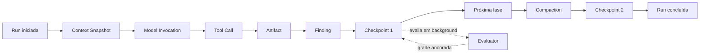
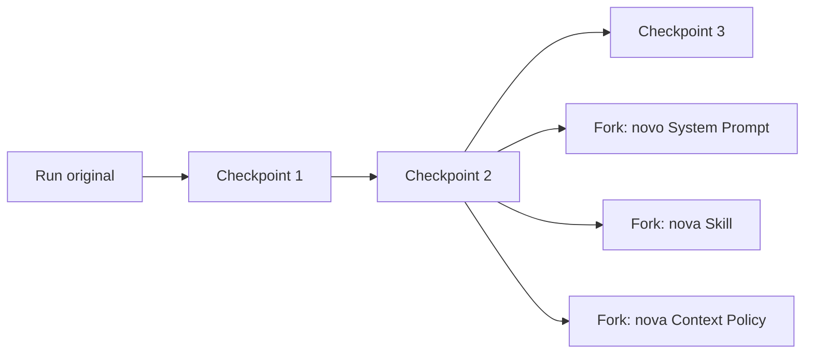

# Canvas vivo e grafo de execução

> Estado: ideia de interação preservada. Não representa UI aprovada, compromisso de roadmap ou
> modelo de dados definitivo.

## Intenção original

Runs de agentes não deveriam parecer apenas um chat estático ou uma tabela que só ganha valor quando
a execução termina. Como humanos, entendemos progresso, caminhos e mudanças com mais facilidade
quando conseguimos ver algo se formando na tela.

A ideia é oferecer uma visualização alternativa semelhante a um tabuleiro, mapa ou canvas muito
grande. Enquanto a Run avança, novos nodes aparecem e se conectam. O caminho deixa artifacts,
findings, tool calls, compactações e marcos visíveis até chegar ao estado final.

Checkpoints ou marcos importantes permanecem como pontos históricos estáveis. Agentes avaliadores
podem analisar o que aconteceu até um checkpoint em background enquanto o Subject Agent continua
executando etapas posteriores.

## Metáforas visuais candidatas

Nenhuma foi escolhida:

- tabuleiro semelhante a xadrez;
- canvas espacial livre;
- mapa de execução;
- grafo causal;
- trilha ou jornada;
- árvore de forks a partir de checkpoints;
- combinação de timeline com canvas.

Nomes de trabalho possíveis:

- Run Map;
- Execution Graph;
- Trace Canvas;
- Evidence Board;
- Agent Journey.

## Princípio de dados

O canvas não deveria se tornar uma segunda fonte de verdade. Ele pode ser uma projeção incremental do
event ledger, Context Snapshots, artifacts, findings e checkpoint records.



## InteractionProtocolGraph, SemanticExecutionGraph e canvas

Três estruturas futuras possuem responsabilidades diferentes:

- `InteractionProtocolGraph` define antes da Run quais interações, prompts, triggers e edges podem
  ocorrer;
- `SemanticExecutionGraph` projeta incrementalmente, a partir dos eventos observados, quais
  WorkUnits, fases e mudanças de foco parecem descrever a trajetória real;
- o canvas é uma apresentação derivada que pode sobrepor o caminho planejado ao caminho observado.

Uma classificação semântica não é fato sobre o estado interno do agente nem checkpoint válido. Ela
precisa preservar confidence, regras ou classificador e evidence refs. Um marco inferido começa como
`CheckpointCandidate`; somente validação determinística autorizada pode produzir um
`CheckpointRecord`.

O `SemanticExecutionGraph` pode ser prototipado sobre o event ledger antes da implementação do
runtime do `InteractionProtocolGraph`. A análise completa está preservada em
[Matriz de contexto e grafo semântico da execução](semantic-execution-graph-concept.md).

Nodes possíveis:

- início, pausa, retomada e término;
- Goal e subproblemas observáveis;
- prompt entregue;
- model invocation;
- Context Snapshot;
- tool call e tool result;
- skill exposta, carregada ou invocada;
- artifact criado ou modificado;
- Finding proposto ou adjudicado;
- compaction;
- approval;
- erro, timeout ou retry;
- checkpoint;
- grader ou avaliação humana;
- intervenção humana;
- fork para nova Run.

Edges possíveis:

- sequência temporal;
- causou;
- usou como entrada;
- produziu;
- derivado de;
- resume de;
- avalia;
- contradiz;
- confirma;
- pertence ao mesmo span ou fase.

## Crescimento ao vivo

Uma direção possível é usar o stream de eventos para inserir nodes progressivamente:

```text
RunEvent append-only
→ projector incremental
→ node ou edge
→ layout atualizado
→ canvas renderizado
```

O usuário poderia acompanhar a Run sem depender apenas de mensagens de chat. O canvas mostraria
atividade, caminhos, bloqueios e regiões que já possuem evidência estável.

Questões de interação candidatas:

- acompanhar automaticamente o node mais recente;
- pausar o auto-follow para explorar o passado;
- selecionar um node e abrir evidência detalhada;
- expandir ou recolher spans repetitivos;
- filtrar somente tools, findings, tokens, prompts ou checkpoints;
- alternar entre tempo, causalidade e hierarquia;
- comparar dois caminhos sobrepostos;
- iniciar um fork a partir de um checkpoint compatível;
- fixar artifacts importantes no canvas;
- mostrar áreas ainda não avaliadas.

## Checkpoints como regiões históricas estáveis

Quando um checkpoint válido é registrado, ele pode criar uma fronteira visual e de avaliação. Um
evaluator recebe somente a evidência até aquele marco, identificada por:

- `run_id`;
- `checkpoint_id`;
- `up_to_event_sequence`;
- `event_hash`;
- `checkpoint_hash`;
- Context Snapshot e artifact refs permitidos;
- Evaluation Plan revision.

Enquanto isso, o Subject Agent pode continuar produzindo eventos depois do checkpoint.

Esse desenho permitiria avaliações concorrentes sem confundir tempos:

```text
Subject Agent: eventos 121 → 122 → 123 → 124 → 125 ...
Checkpoint A: fechado no evento 120
Evaluator A: analisa somente eventos 1..120
```

O resultado do evaluator precisa apontar para o checkpoint ou event cursor avaliado. Ele não deve
parecer uma avaliação de eventos posteriores que ainda não existiam.

## Avaliadores em background

A ideia abre espaço para diferentes evaluators atuarem sobre segmentos estáveis:

- grader determinístico;
- verificador de artifact;
- analisador de segurança;
- detector de loops;
- avaliador de uso de tools;
- judge baseado em modelo;
- revisão humana assíncrona.

Cada avaliação poderia aparecer como um node lateral conectado ao checkpoint ou span avaliado. O
Subject Agent não recebe automaticamente essa avaliação, evitando feedback ou vazamento não previsto.

Se uma Evaluation Plan permitir feedback durante a Run, a entrega desse feedback deve produzir um
evento separado e uma edge explícita de intervenção.

## Artifacts e findings no caminho

Artifacts podem aparecer como objetos persistentes no mapa, conectados aos eventos que os criaram,
leram ou alteraram. Findings podem aparecer como claims com estado visual:

```text
proposed → evidence_attached → verified → accepted
                              ↘ rejected
```

Isso permitiria diferenciar um achado alegado de um achado realmente sustentado por evidência.

## Tokens, tools e skills como overlays

O canvas principal não precisa renderizar todas as métricas ao mesmo tempo. Overlays podem mostrar:

- tamanho do node proporcional a tokens;
- cor por custo ou latência;
- halo para reasoning ou compaction;
- linha mais espessa para múltiplas tool calls;
- ícone e revision da skill;
- heatmap por fase;
- warnings de budget;
- segmentos com alta repetição;
- região com contexto truncado ou compactado.

Esses elementos seriam projeções dos dados canônicos, não valores atualizados manualmente na UI.

## Forks e comparação espacial

Um checkpoint pode se tornar ponto de origem para várias Runs derivadas:



O canvas poderia permitir comparar visualmente:

- onde os caminhos divergiram;
- tools diferentes;
- findings preservados ou perdidos;
- token usage depois do fork;
- checkpoints alcançados;
- scores e guardrails;
- limitações de replayability.

## Riscos a investigar

- Grafos grandes podem ficar visualmente caóticos.
- Um layout animado pode mover nodes enquanto o usuário tenta inspecioná-los.
- A aparência de causalidade pode ser enganosa se uma edge representar apenas sequência.
- Milhares de tool events podem exigir agrupamento ou níveis de detalhe.
- Avaliadores em background podem consumir quota e competir por recursos.
- Uma grade provisória não pode parecer definitiva.
- Findings não verificados precisam de distinção visual forte.
- Forks por restore, replay e context extraction não podem parecer equivalentes.
- Dados sensíveis precisam obedecer à mesma capture policy do restante do produto.
- O renderer não deve receber raw apenas para desenhar um node.
- A visualização não deve incentivar o agente a gerar eventos ou checkpoints artificiais para parecer
  mais ativo.

## Perguntas abertas de produto e design

- O mapa deve ser principalmente temporal, causal, hierárquico ou espacial?
- A metáfora de xadrez ajuda a compreender decisões ou limita demais a variedade de Runs?
- Nodes representam eventos individuais, spans agregados ou ambos por nível de zoom?
- Como indicar certeza, validade, provisionalidade e dado ausente?
- Como representar uma Run pausada esperando aprovação?
- Como navegar entre chat, canvas, timeline e relatório sem duplicar informações?
- Quais ações são apenas inspeção e quais podem criar uma intervenção ou nova Run?
- Quando um evaluator background deve iniciar: evento, tempo, checkpoint ou solicitação humana?
- Quantos evaluators podem atuar simultaneamente?
- Como congelar visualmente um checkpoint enquanto a Run continua à frente?
- Como testar se o canvas realmente melhora entendimento e não apenas aparência?

## Possível protótipo futuro

Antes de implementar um grafo completo, seria possível testar a ideia com um protótipo que apenas
projeta eventos existentes do `CRL-CTX-002`:

1. Run iniciada;
2. contexto composto;
3. Subject Runner invocado;
4. resposta;
5. grader;
6. conclusão.

Depois poderiam ser adicionados artifacts, findings, checkpoints e forks simulados. A decisão de
implementar ainda dependeria de validação de utilidade, legibilidade e performance.

## Regra de promoção

Esta nota não escolhe biblioteca de grafo, layout, modelo de node ou roadmap. Qualquer parte promovida
precisa de contrato de dados, threat model, critérios de UX e ADR quando afetar a arquitetura.

Ver também: [Runs, contratos e checkpoints](run-laboratory-concept.md) e
[Matriz de contexto e grafo semântico da execução](semantic-execution-graph-concept.md).
