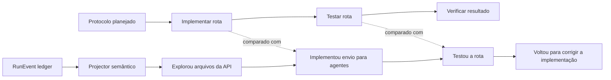

# Matriz de contexto e grafo semântico da execução

> Estado: feature futura preservada para reuso. Este documento não descreve runtime existente, não
> define contrato aceito, não escolhe UI ou classificador e não autoriza implementação automática.
> A ideia foi deliberadamente adiada enquanto a fundação de contratos e runtime passa por revisão e
> endurecimento.

## Origem e motivação

A proposta surgiu da intenção de acompanhar uma Run longa em tempo real sem reduzi-la a uma lista
plana de mensagens e tool calls. Além de saber o que aconteceu, um humano deveria conseguir
inspecionar como o foco observável do agente se deslocou entre assuntos, fases, artifacts e
subproblemas.

Uma futura projeção semântica poderia:

- agrupar tool calls, arquivos, mensagens, artifacts e outros eventos por proximidade semântica;
- observar quando o agente muda de assunto, fase ou unidade de trabalho;
- tornar visíveis retornos, desvios, bloqueios, retomadas e ciclos de correção;
- relacionar o contexto entregue às atividades que pareciam estar em foco;
- ajudar humanos a auditar por que determinada informação, tool ou skill foi usada;
- acompanhar incrementalmente Runs com dezenas ou centenas de turnos;
- sugerir marcos candidatos sem transformar uma inferência em checkpoint válido.

Exemplo de uma unidade semântica de trabalho:

```text
Projeto → API → Agent Messaging
```

Implementar a rota e testar a rota continuam semanticamente ligados a `Agent Messaging`. A mudança
principal ocorre na fase da atividade, e não necessariamente no assunto. Misturar assunto e fase em
uma única hierarquia faria os testes parecerem mais distantes da feature do que realmente são.

Esta ideia é compatível com a tese auditável do Evidrun, mas ainda precisa demonstrar que melhora a
compreensão humana e não apenas produz uma visualização atraente.

## Dois grafos com responsabilidades diferentes

O termo “grafo” pode descrever estruturas com autoridades distintas. A proposta separa pelo menos
três objetos:

| Grafo ou visão | Origem | Função | Autoridade candidata |
| --- | --- | --- | --- |
| `InteractionProtocolGraph` | Definição pré-Run | Controlar interações, prompts, triggers e edges permitidas | Contrato futuro |
| `SemanticExecutionGraph` | Eventos observados | Interpretar a trajetória real da execução | Projeção versionada |
| Canvas ou `ContextDirectionMatrix` | Projeção dos dois | Permitir inspeção humana | UI derivada |

O `InteractionProtocolGraph` descreve caminhos que a execução pode seguir. O
`SemanticExecutionGraph` descreve, com confiança e evidência, como a trajetória observada foi
classificada. O canvas pode futuramente sobrepor o caminho planejado ao caminho observado.



O `SemanticExecutionGraph` pode ser prototipado sobre o event ledger antes de existir um runtime
capaz de executar o `InteractionProtocolGraph`. Essa separação permite validar a utilidade da
observabilidade semântica sem acoplá-la ao futuro motor de interação.

## Separação entre scope e phase

A matriz usa duas dimensões independentes.

`scope_path` representa o assunto ou unidade de trabalho:

```text
Projeto / API / Agent Messaging
```

`phase` representa o tipo de atividade observável:

```text
planning
exploration
implementation
testing
diagnosis
verification
reporting
```

Exemplo:

```text
Implementação:
scope_path = Projeto / API / Agent Messaging
phase = implementation

Testes:
scope_path = Projeto / API / Agent Messaging
phase = testing
```

O scope permanece próximo enquanto a fase muda. Uma futura matriz `WorkUnit × phase` poderia
agrupar spans e marcos sem afirmar que uma sequência ideal é obrigatória:

| Unidade de trabalho | Planejamento | Exploração | Implementação | Testes | Verificação |
| --- | --- | --- | --- | --- | --- |
| API / Agent Messaging | eventos 1–4 | eventos 5–13 | eventos 14–31 | eventos 32–44 | eventos 45–50 |
| Autorização da API | — | eventos 18–20 | eventos 21–24 | eventos 38–40 | evento 47 |
| Contrato de mensagem | eventos 3–4 | eventos 8–10 | eventos 14–18 | eventos 33–37 | evento 46 |

Esses números são apenas exemplo de representação. Eles não referenciam uma Run real e não são
evidência de comportamento implementado.

Uma ação também pode possuir um scope primário e scopes secundários. Um teste de autorização da
rota de mensagens pode pertencer principalmente a `Agent Messaging` e secundariamente a
`Authorization`, sem forçar uma única posição na árvore.

## Camadas de autoridade da informação

O sistema não deve tratar interpretação, sugestão e validação como equivalentes.

### 1. Evidência observada

É a base permitida para qualquer projeção:

- RunEvents;
- tool calls e resultados;
- mensagens permitidas pela capture policy;
- arquivos e paths observáveis;
- artifacts;
- Context Snapshots;
- avaliações e checkpoints existentes;
- eventos de provider, usage, compaction e aprovação quando disponíveis.

Essa camada permanece canônica conforme os contratos próprios de cada registro.

### 2. Interpretação semântica

É uma leitura versionada da evidência:

- WorkUnits;
- FocusSpans;
- fases e atividades;
- relações entre scopes;
- transições;
- confidence;
- classificadores e regras utilizadas.

Uma interpretação pode ser reconstruída, corrigida ou substituída por nova revisão sem reescrever o
event ledger.

### 3. Marco candidato

Um `CheckpointCandidate` sugere uma boundary que parece importante, mas ainda pode falhar:

- checkpoint definition candidata;
- event cursor sugerido;
- sinais observados de conclusão;
- confidence;
- validações ainda pendentes;
- evidence refs.

### 4. Marco validado

Somente um serviço determinístico autorizado pode produzir um futuro `CheckpointRecord`, com:

- cursor e event hash;
- validators executados;
- artifacts e snapshots permitidos;
- resultados das validações;
- checkpoint hash;
- limitações de replayability.

Fluxo de autoridade:

```text
Evento observado
→ interpretação semântica versionada
→ checkpoint candidato
→ checkpoint validado
```

Um número maior de spans ou checkpoints não significa automaticamente maior qualidade.

## Vocabulário candidato

Os nomes abaixo são de trabalho. Nenhum deles é contrato aceito por aparecer neste documento.

- `SemanticExecutionGraph`: grafo observado completo;
- `ContextDirectionMatrix`: visão por scope e phase;
- `WorkUnit`: unidade semântica de trabalho;
- `FocusSpan`: intervalo coerente de eventos;
- `FocusTransition`: mudança de scope ou phase;
- `SemanticProjectionPlanRevision`: regras versionadas de classificação;
- `SemanticSpanProjection`: projeção reconstruível de um span;
- `SemanticTransitionProjection`: mudança e distância decomposta;
- `SemanticAdjudicationRecord`: correção humana append-only;
- `CheckpointCandidate`: sugestão de marco ainda não validada.

`WorkUnit` pode representar projeto, subsistema, feature, endpoint, comportamento, bug, pergunta
investigativa ou grupo de artifacts. Uma WorkUnit definida antes da Run possui autoridade diferente
de uma WorkUnit descoberta automaticamente durante a execução.

Uma descoberta automática deveria começar como candidata e preservar a evidência que motivou sua
criação. A aceitação humana ou contratual dessa unidade seria uma operação posterior e explícita.

## Estruturas candidatas dos registros

### FocusSpan

Estrutura conceitual:

```text
span_id
run_id
from_event_sequence
to_event_sequence
primary_work_unit
secondary_work_units
phase
activity
artifact_refs
confidence
inference_source
classifier_ref
evidence_refs
projection_revision
```

Exemplo hipotético:

```text
events: 14..31
primary_work_unit: feature:agent-messaging
phase: implementation
activity: editing_route_and_service
confidence: 0.94
evidence:
  - event:14
  - event:17
  - event:23
  - artifact:src-api-route
```

O formato correto de uma interpretação é:

> Os eventos observáveis nesta faixa são mais consistentes com determinada WorkUnit e fase.

Um FocusSpan não afirma acesso ao pensamento privado, hidden chain-of-thought ou estado interno do
modelo. Mesmo uma mensagem como “agora vou testar a rota” é apenas um sinal: as ações subsequentes
podem confirmar ou contradizer o foco declarado.

### FocusTransition

Uma transição candidata preservaria:

- origem e destino;
- event boundary;
- scope anterior e posterior;
- phase anterior e posterior;
- sinais usados na classificação;
- decomposição da distância;
- projector revision;
- confidence e alternativas relevantes.

Exemplo:

```text
from: Projeto / API / Agent Messaging / implementation
to:   Projeto / API / Agent Messaging / testing
```

Nesse caso, a distância de scope tende a ser pequena, enquanto a distância de phase aumenta.

### CheckpointCandidate

Um candidato poderia registrar:

```text
definition: agent-messaging-implementation-complete
boundary: event 31
signals:
  - implementation span ended
  - route artifact created
  - subject announced completion
  - testing span began
confidence: 0.82
pending_validations:
  - structural validation
  - authorized tests
```

O candidato não vira fato por possuir confidence alta. A promoção depende dos validators definidos
antes da Run ou aceitos por autoridade apropriada.

## Pipeline de inferência

Ordem recomendada:

```text
RunEvent ledger
→ extração de sinais
→ regras determinísticas
→ relações causais e de artifacts
→ classificador semântico opcional
→ smoothing temporal
→ FocusSpans e transitions
→ CheckpointCandidates
→ projeção visual
```

Prioridades:

1. regras determinísticas;
2. paths, artifacts e causation;
3. classificadores ou embeddings opcionais;
4. adjudicação humana.

### Sinais determinísticos candidatos

- leitura ou busca → provável `exploration`;
- edição → provável `implementation`;
- execução de testes → provável `testing`;
- falha seguida de leitura e correção → possível `diagnosis`;
- lint, typecheck ou build → provável `verification`;
- declaração e estruturação de passos → provável `planning`;
- resumo terminal → provável `reporting`;
- leitura e escrita no mesmo conjunto de artifacts → continuidade provável de scope;
- teste que referencia código alterado → relação causal ou de avaliação candidata.

O tipo de tool isolado não basta. Ler um arquivo de teste pode ser exploração, diagnóstico,
preparação para edição ou verificação. O projector deve considerar janela temporal, artifacts,
causation, mensagens permitidas e transições anteriores.

### Relações estruturais e causais

Sinais adicionais podem vir de:

- `causation_id` e `correlation_id`;
- tool call e tool result;
- arquivo lido e arquivo alterado;
- código alterado e teste executado;
- erro e correção subsequente;
- plano declarado e ações observadas;
- checkpoint e avaliação;
- artifact produzido e evento que o originou.

Sequência temporal, causalidade e pertencimento ao mesmo scope precisam continuar sendo edges
distintas. Uma ação posterior ou um node próximo não prova que houve causalidade.

### Classificação semântica opcional

Embeddings ou classificadores baseados em modelo poderiam:

- relacionar nomes diferentes da mesma feature;
- classificar mensagens ou artifacts em WorkUnits existentes;
- sugerir nova WorkUnit quando a taxonomia não cobre o assunto;
- diferenciar exploração, diagnóstico e implementação em sinais ambíguos.

Cada execução de classificador deveria preservar:

- provider e modelo;
- versão;
- prompt ou classifier spec;
- digest;
- inputs autorizados;
- output estruturado;
- confidence;
- alternativas consideradas;
- limitações conhecidas.

Conteúdo restricted nunca pode ser enviado ao classificador. Conteúdo sensitive continua sujeito à
capture policy, grants e retenção. Um classificador probabilístico enriquece a projeção; não
substitui o event ledger.

### Adjudicação humana

Uma futura correção humana poderia declarar:

```text
events 32..36 não representam uma nova funcionalidade;
representam testes da Agent Messaging API.
```

Essa correção não apagaria a projeção anterior. Um `SemanticAdjudicationRecord` append-only deveria
referenciar a classificação original, a nova classificação, rationale, evidence refs, ator e
timestamp.

## Estabilidade temporal

Classificar eventos isolados faria o foco oscilar excessivamente. Uma Run coerente poderia parecer:

```text
API → testes → API → docs → API → testes → API
```

mesmo quando todos esses eventos pertencem à mesma entrega.

Um futuro projector precisa investigar:

- janela de eventos recentes;
- duração mínima de span;
- limiar de confidence;
- diferença mínima em relação ao foco atual;
- hysteresis;
- primary e secondary scopes;
- transições provisórias;
- número mínimo de sinais para fechar um span;
- pequena janela de ajuste retroativo da boundary.

Exemplo:

```text
eventos 14–31: implementation / agent-messaging
evento 32: lê arquivo de teste
evento 33: lê fixture
evento 34: executa testes autorizados

no evento 34:
fecha implementation span
abre testing span a partir do evento 32
```

O ajuste da boundary cria nova revisão da projeção. O ledger e os eventos 32–34 não são reescritos.

## Distância explicável

A posição de nodes num canvas não pode ser a única explicação de proximidade. Uma distância
semântica candidata deveria ser decomposta em dimensões inspecionáveis:

- `scope_distance`;
- `phase_distance`;
- `artifact_distance`;
- `causal_distance`;
- `temporal_distance`.

Fórmula de trabalho, ainda não aceita:

```text
distance =
  w_scope    × scope_tree_distance
+ w_phase    × phase_distance
+ w_artifact × artifact_dissimilarity
+ w_causal   × causal_separation
+ w_time     × temporal_separation
```

Na transição de implementação para testes da mesma rota:

- `scope_distance` tende a ser pequena;
- `phase_distance` aumenta;
- `artifact_distance` pode crescer ao sair de source para test files;
- `causal_distance` tende a permanecer pequena quando o teste avalia o código anterior;
- `temporal_distance` tende a ser pequena numa transição imediata.

Pesos e algoritmos pertencem a uma futura `SemanticProjectionPlanRevision`. A UI deve permitir
inspecionar a decomposição e nunca sugerir que proximidade visual prova causalidade, qualidade ou
intenção privada.

## Camadas candidatas do canvas

O canvas poderia oferecer overlays independentes:

- evidência bruta permitida;
- WorkUnits e FocusSpans;
- checkpoints e evaluations;
- Context Snapshots;
- tools e skills;
- tokens, custo e latência;
- compaction;
- budgets;
- confidence e provisionalidade;
- caminho planejado versus observado;
- divergências entre foco declarado e foco inferido.

O renderer não deve receber raw sensível apenas para desenhar nodes. Agregações e labels precisam
obedecer às mesmas políticas de classificação, captura e retenção das evidências de origem.

Milhares de eventos podem exigir níveis de detalhe:

```text
Run
→ WorkUnit
→ FocusSpan
→ grupo de eventos
→ evento individual
```

O layout é uma projeção regenerável e não deve virar fonte de verdade para relações, posições ou
distâncias.

## Métricas candidatas

As métricas abaixo descrevem trajetória. Elas só podem influenciar score quando um futuro
`EvaluationPlan` definir antecipadamente critérios, limitações e fontes de evidência.

### Desvio de scope

Distância e duração de uma trajetória fora da WorkUnit ativa. Um desvio pode representar erro,
investigação legítima ou descoberta de dependência; não deve ser penalizado automaticamente.

### Tempo de reentrada no contexto

Quantidade de eventos, tempo ou contexto necessário para retornar a uma WorkUnit após interrupção,
subproblema ou compaction.

### Churn de foco

Quantidade de alternâncias entre WorkUnits ou fases. Churn alto pode refletir stuckness, plano
instável, arquitetura acoplada ou investigação necessária.

### Alinhamento entre contexto e foco

Relação entre Context Snapshots, arquivos, tools e skills oferecidos e a WorkUnit que parecia ativa.
Isso permite investigar:

- contexto relevante ou semanticamente distante;
- informação de fase anterior mantida depois de uma transição;
- recuperação de informação removida por compaction;
- repetição de leituras após perda de contexto;
- uso de capability sem relação observável com o foco.

### Coerência das transições

Comparação entre uma trajetória esperada e a observada, sem exigir um caminho universalmente ideal.

```text
Esperado:
planning → exploration → implementation → testing → verification

Observado:
planning → implementation → diagnosis → exploration → implementation → testing
```

A segunda trajetória pode revelar uma dependência desconhecida em vez de baixa qualidade.

### Cobertura de fases

Questões candidatas:

- houve implementação sem teste ou verificação observável?
- houve conclusão declarada sem artifact ou evidence ref?
- houve exploração extensa sem finding ou entrega?
- o agente voltou à implementação depois da verificação?

### Relevância contextual de tools e skills

Uma futura projeção poderia classificar uma capability como:

```text
relevante ao scope atual
relevante a uma dependência
de propósito incerto
semanticamente distante
```

A classificação precisa preservar confidence e evidência. Uma tool semanticamente distante pode
ser exatamente o passo necessário para resolver o problema.

### Divergência entre foco declarado e observado

Exemplo:

```text
declared_focus: testing
observed_focus: continued implementation
```

Essa divergência é uma observação auditável, não prova de engano ou falha.

### Compaction, falhas e stuckness

Outras investigações futuras incluem:

- mudança de distância semântica antes de uma falha;
- perda e recuperação de WorkUnits após compaction;
- repetição de scopes sem progresso observável;
- retomada tardia de constraint ou artifact relevante;
- loops entre diagnosis e implementation.

## Exemplo hipotético de uma Run longa

Eventos candidatos:

```text
01  agente declara um plano
02  busca rotas existentes
03  lê contrato da API
04  lê serviço de agentes
05  busca schema de mensagens
06  edita rota
07  edita serviço
08  executa typecheck
09  lê testes existentes
10  cria teste da rota
11  executa teste
12  teste falha
13  volta ao serviço
14  corrige serialização
15  executa teste novamente
16  teste passa
17  executa suíte autorizada da API
18  conclui e resume
```

Projeção candidata:

```text
FocusSpan A — eventos 01..01
scope: API / Agent Messaging
phase: planning

FocusSpan B — eventos 02..05
scope: API / Agent Messaging
phase: exploration

FocusSpan C — eventos 06..08
scope: API / Agent Messaging
phase: implementation

CheckpointCandidate C1 — evento 08
"implementação estruturalmente válida"
pendência: testes funcionais

FocusSpan D — eventos 09..12
scope: API / Agent Messaging
phase: testing

FocusSpan E — eventos 13..14
scope: API / Agent Messaging
phase: diagnosis_and_implementation

FocusSpan F — eventos 15..17
scope: API / Agent Messaging
phase: testing_and_verification

CheckpointRecord C2 — evento 17
"rota implementada e testes autorizados passaram"

FocusSpan G — evento 18
scope: API / Agent Messaging
phase: reporting
```

Esse exemplo é apenas uma hipótese de representação. Não existe `run:`, `event:` ou `artifact:` real
associado a ele, e nenhum checkpoint foi produzido pelo Evidrun.

O retorno do teste para a implementação forma uma relação útil:

```text
test failure
→ diagnosis
→ implementation correction
→ retest
```

Essa transição não é necessariamente perda de foco. Ela pode ser evidência de um ciclo coerente de
correção.

## Riscos a investigar

- **Falsa precisão:** uma posição visual pode fazer inferência fraca parecer fato.
- **Classificação instável:** labels podem oscilar a cada evento sem smoothing.
- **Taxonomia rígida:** dependências descobertas podem não caber no plano inicial.
- **Múltiplos focos:** uma ação pode pertencer a várias WorkUnits.
- **Ambiguidade de tools:** a mesma tool pode apoiar fases diferentes.
- **Gaming:** o agente pode ser incentivado a gerar spans ou checkpoints artificiais.
- **Custo:** classificar cada evento com modelo pode atrasar e encarecer a Run.
- **Privacidade:** raw sensível pode vazar para classificador ou renderer.
- **Drift:** modelos ou embeddings diferentes podem alterar labels e layout.
- **Causalidade visual:** proximidade e sequência podem parecer causa.
- **Escala:** grafos grandes podem ficar ilegíveis ou instáveis.
- **Trajetória estética:** caminhos “bonitos” podem ser recompensados sem relação com o resultado.

Mitigações candidatas:

- regras determinísticas primeiro;
- inferência probabilística como enriquecimento;
- confidence e fonte visíveis;
- versões e digests preservados;
- smoothing e hysteresis;
- adjudicação humana append-only;
- capture policy aplicada em todas as camadas;
- projeções regeneráveis;
- métricas fora de scores universais;
- distinção visual forte entre observado, inferido, candidato e validado.

## Protótipo futuro deliberadamente pequeno

Antes de um canvas interativo, um protótipo poderia usar:

1. fixture de Run com 30–50 eventos;
2. três a cinco WorkUnits definidas;
3. fases `planning`, `exploration`, `implementation`, `testing`, `diagnosis`, `verification` e
   `reporting`;
4. projector determinístico baseado em eventos, paths, artifacts e causation;
5. FocusSpans e FocusTransitions;
6. CheckpointCandidates sem promoção automática;
7. saída JSON e matriz Markdown;
8. revisão humana das classificações;
9. comparação entre timeline simples e matriz semântica.

Critérios para validar utilidade:

- melhora o entendimento humano da trajetória;
- evidencia desvios, retornos e mudanças de fase;
- cada classificação aponta para evidência;
- correções humanas permanecem administráveis;
- diferentes pessoas interpretam o resultado de maneira consistente;
- a projeção revela algo que a timeline comum não revela;
- funciona incrementalmente sem atrasar materialmente a Run;
- não confunde inferência, validação e causalidade;
- não exige acesso a pensamento privado do agente.

Uma saída Markdown ou JSON é preferível no primeiro teste porque força a validade do modelo
semântico antes de decisões de canvas, animação ou biblioteca de grafo.

## Gate de promoção

A feature só deve sair de incubação após existir:

- fixture e protocolo de avaliação;
- demonstração de utilidade humana;
- modelo de dados reduzido;
- política de classificação e confidence;
- threat model específico;
- testes de privacidade e retenção;
- contrato de projector;
- decisão sobre adjudicação;
- critérios de performance incremental;
- ADR caso a solução altere arquitetura;
- escolha de UI somente depois da validade do modelo semântico.

Mesmo após promoção, resultados semânticos continuam projeções ancoradas em eventos. Eles não
substituem RunEvents, Context Snapshots, artifacts, evaluations ou CheckpointRecords.

## Decisão de prioridade

A ideia foi considerada promissora e deve ser preservada para experimentação futura. Ela não entra
agora no roadmap ativo: a fundação de contratos, admissão, evidência e runtime foi criada, mas ainda
possui prioridade de revisão e endurecimento. O adiamento reduz competição por atenção sem descartar
a oportunidade.

## Regra de promoção documental

Este documento não escolhe taxonomy, fórmula, embedding, classificador, layout, biblioteca de grafo
ou contrato de dados. Qualquer parte que se torne normativa precisa ser promovida por contract ou
ADR com ownership, compatibilidade, threat model, implementation refs e verification refs.

Ver também: [Canvas vivo e grafo de execução](live-run-graph-concept.md) e
[Runs, contratos e checkpoints](run-laboratory-concept.md).
