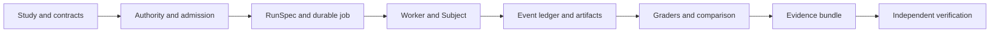

# Evidrun — reviewer guide

> **30-second summary:** Evidrun is a local-first evaluation laboratory for AI agents. It records what changed between baseline and candidate runs, what context and tools were actually delivered, how the run progressed, how it was graded, and which conclusions the evidence can support.

## Why this project exists

Agent evaluations often collapse a complex execution into a final score. Evidrun treats the execution itself as evidence: contracts are revisioned, runs are admitted explicitly, events are durable, outputs can be exported as verifiable bundles, and unsupported capabilities are rejected instead of silently simulated.

The project is currently a technical laboratory rather than a hosted product. Its strongest contribution is the auditable runtime and evidence model, not a polished SaaS workflow.

## What to inspect

| Surface | Why it matters | Starting point |
|---|---|---|
| Canonical run lifecycle | Shows explicit preparation, admission, enqueueing, worker execution and terminal states | `src/evidrun/runs/` |
| Evidence bundles | Exports versioned run/comparison evidence and verifies integrity | `src/evidrun/evidence/` |
| Contracts and authority | Separates intent, revision, trust and execution authority | `src/evidrun/contracts/`, `src/evidrun/authority/` |
| Durable infrastructure | Provides persistence, queues, leases, retries and artifact storage | `src/evidrun/infrastructure/` |
| Deterministic benchmark | Exercises infrastructure without depending on an external model | `benchmarks/` |
| Product surfaces | CLI, API, browser UI and Electron shell | `src/evidrun/entrypoints/`, `apps/` |
| Engineering gates | Runs tests, typing, linting, schema generation, documentation checks and structural budgets | `.github/workflows/ci.yml` |

## Architecture at a glance



## Engineering signals

- Canonical contracts and immutable digests separate declared intent from mutable runtime state.
- The run path uses durable jobs, attempts, leases, heartbeats, fencing and retry rather than an in-memory demo loop.
- The event ledger and evidence bundles are designed to expose tampering and incomplete evidence.
- Deterministic and model-backed Subjects share the same execution boundary.
- Capability admission rejects unsupported combinations explicitly.
- Documentation distinguishes normative contracts and ADRs from temporary plans and research notes.
- CI validates code, contracts, generated artifacts, documentation and structural constraints.

## Current limits

The public runtime is intentionally narrower than the full contract model. Generic tools, skills, nested agents, graph protocols, automatic checkpoints, progress artifacts, bounded exploration and full restore/replay remain incomplete. The desktop creation flow and Laboratory adapter are also still being integrated.

These limits are documented because the repository is intended to make evidence boundaries visible, not to present planned features as completed work.

## Fast evaluation path

```bash
uv sync --extra dev
pnpm install
uv run evidrun init
uv run evidrun doctor
uv run evidrun demo
uv run pytest
pnpm test
```

For a focused code review, follow this path:

1. `src/evidrun/runs/service.py`
2. `src/evidrun/runs/coordinator/`
3. `src/evidrun/runs/worker.py`
4. `src/evidrun/evidence/bundle.py`
5. `docs/contracts/study-run-v1.md`
6. `.github/workflows/ci.yml`

## Suggested GitHub topics

`ai-agents`, `agent-evaluation`, `llm-evaluation`, `evals`, `agent-observability`, `provenance`, `reproducibility`, `context-engineering`, `local-first`, `fastapi`, `electron`, `pydantic`

## Portfolio interpretation

Evidrun is the strongest repository in this portfolio for reviewers interested in AI-agent reliability, evaluation infrastructure, auditability and long-horizon execution. The appropriate claim is not that it is a finished commercial platform; it is that it demonstrates a substantial, test-backed architecture for making agent experiments inspectable and reproducible.
