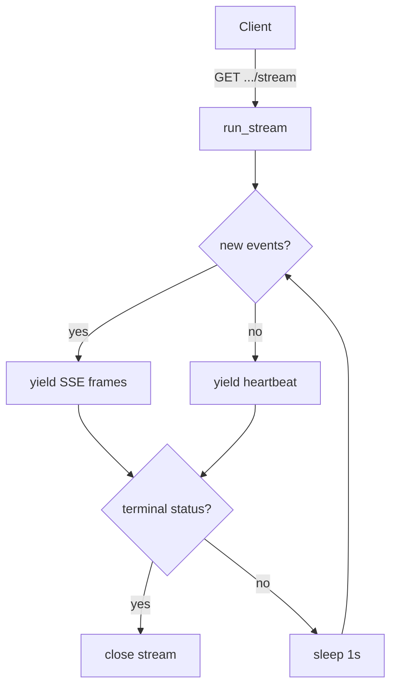

# API

The FastAPI backend is the HTTP surface the renderer and the desktop shell talk to. It is bound to loopback, guarded by a launch-token bearer check when the desktop starts it, and exposes read projections of the dashboard plus the write paths for validation, compilation, admission, demo bootstrap, and bundle export. All domain work goes through the same `Repository` and `EvidrunService` as the CLI.

Defined in `src/evidrun/entrypoints/api/app.py` (about 482 lines).

## Directory layout

```
src/evidrun/entrypoints/api/
  app.py        # create_app, request models, all routes, run()
```

## create_app and startup

`create_app(data_dir, launch_token, benchmark_root)` builds the app:

- Loads `Settings`, ensures directories, opens the `Database`, and calls `create_all()`.
- If `settings.authority_enabled`, wires an `AuthorityRepository`, an `ArtifactStore`, a `LocalWebAuthnVerifier`, and a `HumanAuthorityService`, then mounts the authority router via `create_authority_router(...)`.
- Builds the `Repository` (passing the human attestation verifier), an `EvidrunService`, an `EvidenceBundleService`, and a `ProviderCredentialStore`.
- Resolves the benchmark root (defaults to `<repo>/benchmarks`).
- Registers a `lifespan` that disposes the database on shutdown.

The module-level `run()` reads `EVIDRUN_PORT` (default 8765) and calls `uvicorn.run(create_app(), host="127.0.0.1", ...)`. Loopback only — the app is never intended to bind a public interface.

## Auth and CORS

- **Bearer auth.** `authorize` is a dependency on every route. When `launch_token` is `None` (plain `serve`, or `run()`), it is a no-op. When a token is set (desktop handshake), the request must send `Authorization: Bearer <token>` or it gets 401.
- **CORS allowlist.** Origins are limited to `http://127.0.0.1:5173`, `http://localhost:5173`, `evidrun://app`, and `null`. Credentials are disabled; methods are `GET`, `POST`, `DELETE`; allowed headers are `Authorization`, `Content-Type`, `Idempotency-Key`.

## Request models

| Model | Fields |
| --- | --- |
| `ChatSessionCreate` | `workspace_id`, `title`, optional `scope_type`/`scope_id` |
| `ChatMessageCreate` | `role`, `content` |
| `ManifestRequest` | `yaml` |
| `ContractDocumentRequest` | `document`, `status` (`draft`/`proposed`) |
| `ContractDecisionRequest` | `decision`, `rationale` |

All use `extra="forbid"`.

## Endpoints

| Method + path | Purpose |
| --- | --- |
| `GET /api/v1/health` | Status, version, database path, schema version |
| `GET /api/v1/doctor` | Health flags: data dir, database, benchmark availability, offline demo, default provider, credential availability |
| `GET /api/v1/providers` | List with the single default provider profile |
| `GET /api/v1/providers/default` | The default provider profile plus credential source |
| `GET /api/v1/dashboard` | The full dashboard projection |
| `GET /api/v1/workspaces` | Workspaces slice of the dashboard |
| `GET /api/v1/projects` | Projects slice |
| `GET /api/v1/experiments` | Experiments slice |
| `POST /api/v1/experiments/validate` | Validate a YAML manifest; 422 on failure; returns digest, validity, normalized |
| `POST /api/v1/contracts/validate` | Parse a revision document; returns digest and normalized semantic document; 422 on failure |
| `POST /api/v1/contracts/revisions` | Register a revision (`draft`/`proposed`); returns row fields; 422 on failure |
| `GET /api/v1/contracts/revisions` | List registered revisions |
| `POST /api/v1/contracts/revisions/{id}/decisions` | Fail closed: 404 if unknown, otherwise 503 — a trusted WebAuthn verifier must complete the decision |
| `POST /api/v1/studies/{revision_id}/compile` | Compile a `StudyRevision` into RunSpecs and persist them; 404/422 |
| `POST /api/v1/run-specs/{id}/admit` | Admit a RunSpec; persist the `AdmissionRecord`; returns decision, digest, missing requirements |
| `GET /api/v1/run-specs/{id}` | Return the RunSpec semantic dump plus digest; 404 |
| `GET /api/v1/admissions/{id}` | Return the `AdmissionRecord` plus digest; 404 |
| `POST /api/v1/demo/bootstrap` | Run `bootstrap_demo` off-thread against `benchmarks/` |
| `GET /api/v1/runs` | Runs slice of the dashboard |
| `GET /api/v1/runs/{id}` | Dashboard row + run record + full event ledger; 404 |
| `GET /api/v1/runs/{id}/events` | Raw event ledger for the run |
| `GET /api/v1/runs/{id}/evaluations` | Evaluation records plus digests |
| `GET /api/v1/runs/{id}/checkpoints` | Checkpoint records plus checkpoint hash |
| `GET /api/v1/runs/{id}/stream` | SSE stream of new events; heartbeats every second; ends on terminal status |
| `GET /api/v1/comparisons` | Comparisons slice |
| `GET /api/v1/comparisons/{id}` | A single comparison; 404 |
| `POST /api/v1/chat/sessions` | Create a chat session |
| `GET /api/v1/chat/sessions` | List chat sessions |
| `POST /api/v1/chat/sessions/{id}/messages` | Append a chat message |
| `POST /api/v1/evidence-bundles/{comparison_id}` | Export a v2 bundle off-thread; returns the file path |

The authority router adds its own routes on top; see [authority](../systems/authority.md).

## The SSE stream

`GET /runs/{id}/stream` returns a `text/event-stream`. It polls `get_run_events(run_id)` in a loop, emitting only events past the last count, formatted as `event: <type>\ndata: <json>\n\n`. It sends a `: heartbeat` comment each cycle and returns once the run reaches a terminal status (`completed`, `failed`, `cancelled`, `budget_exhausted`, `guardrail_stopped`) and at least one event was emitted. It stops early if the client disconnects.



## Integration points

- **Renderer.** The [web renderer](web.md) calls a small subset (`/dashboard`, `/providers/default`, `/demo/bootstrap`, `/evidence-bundles/{id}`) through `apps/web/src/api/client.ts`, sending the bearer token from the desktop bridge.
- **Desktop.** The [desktop shell](desktop.md) spawns this app via `serve --desktop-handshake` and injects the launch token, activating the bearer check.
- **Domain.** Compilation, admission, demo, and bundle export delegate to `EvidrunService`, `StudyCompiler`, and `EvidenceBundleService`. See [run execution](../systems/run-execution.md).

## Entry points for modification

- Add an endpoint: define it inside `create_app` so it captures `repository`, `service`, and `authorize`. Keep `_: None = Depends(authorize)` on every route.
- Change fail-closed decision handling: the 503 in `decide_contract` is intentional; route real decisions through the authority router, mirroring the CLI's `authority accept`.

## Key source files

| Path | Role |
| --- | --- |
| `src/evidrun/entrypoints/api/app.py` | The FastAPI app |
| `src/evidrun/authority/router.py` | Authority router mounted by `create_app` |
| `src/evidrun/runs/__init__.py` | `EvidrunService` |
| `src/evidrun/evidence/bundle.py` | `EvidenceBundleService` |
| `src/evidrun/shared/settings.py` | `Settings` and the default provider profile |
