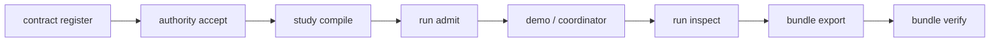

# CLI

The Typer CLI is the primary in-process surface for operating Evidrun from a terminal. It initializes the local data directory, runs the offline demo, walks a contract revision through compilation and admission, exports and verifies evidence bundles, and enrolls and confirms human authority. Everything runs against the same `Repository` and `EvidrunService` the API uses.

Defined in `src/evidrun/entrypoints/cli/app.py` (about 525 lines). The full per-command table lives in the [command reference](command-reference.md).

## Directory layout

```
src/evidrun/entrypoints/cli/
  app.py        # the entire Typer tree, sub-apps, and command bodies
```

## Command tree

The root app is `evidrun`. Nine sub-apps group the commands by concern, plus four top-level commands.

```
evidrun
  --version
  init            initialize a data directory
  doctor          environment and provider health checks
  serve           run the FastAPI backend (loopback or desktop handshake)
  demo            bootstrap the CRL-CTX-002 demo offline
  experiment      validate / accept experiment manifests
  contract        validate, register, and (fail-closed) accept revisions
  study           compile accepted Studies into RunSpecs
  run             admit and inspect runs
  bundle          export and verify evidence bundles
  chat            inspect chat sessions
  data            managed-data notices
  provider        configure and diagnose the model provider
  authority       enroll credentials and confirm human authority
```

## Key abstractions

| Symbol | File | Purpose |
| --- | --- | --- |
| `app` (root Typer) | `src/evidrun/entrypoints/cli/app.py` | Registers all sub-apps and the `--version` callback |
| `_components()` | `src/evidrun/entrypoints/cli/app.py` | Loads `Settings`, opens the `Database`, returns a plain `Repository` |
| `_authority_service()` | `src/evidrun/entrypoints/cli/app.py` | Builds a `HumanAuthorityService` and `AuthorityRepository` for enroll/accept |
| `serve --desktop-handshake` | `src/evidrun/entrypoints/cli/app.py` | Reads a stdin handshake, binds an ephemeral port, prints readiness JSON |

## Fail-closed behavior

Two decision paths deliberately refuse to act without verifiable human authority:

- `contract accept` prints that verified human authority is unavailable and exits with code 1. It never mutates the revision. The message points to a trusted WebAuthn verifier as the required path.
- The `authority accept` command is the working path. It attaches a `LocalWebAuthnVerifier` to the repository, builds a `RevisionDecisionSubject`, and calls `service.confirm_with_local_authenticator(...)` with an enrolled `credential_id`. Only after that attestation succeeds does it call `repository.decide_contract_revision(...)`.

This mirrors the API, where `POST /contracts/revisions/{id}/decisions` returns 503. See [authority](../../systems/authority.md).

## The desktop handshake

`serve --desktop-handshake` is how the Electron shell launches the backend. The sequence:

1. Read one line of JSON from stdin. It carries `token` and optionally `data_dir`.
2. Adopt the launch token as the API's bearer token and, if given, the data directory.
3. Bind a fresh `AF_INET` socket on `127.0.0.1` at port 0 (the OS picks a free port), then `listen`.
4. Print a single readiness line to stdout: `{"protocol": "evidrun-desktop-v1", "port": ..., "backend_instance_id": ..., "schema_version": "1", "pid": ..., "health_nonce": ...}`.
5. Start uvicorn on the already-bound socket via `server.run(sockets=[listener])`.

Without `--desktop-handshake`, `serve` just calls `uvicorn.run(create_app(...))` on the given host and port (default `127.0.0.1:8765`) with no launch token, so `authorize` is a no-op. See [desktop](../desktop.md) for the spawning side.

## How a run reaches evidence from the CLI



The `demo` command shortcuts this whole path for CRL-CTX-002 by calling `EvidrunService.bootstrap_demo(...)` against the `benchmarks/` directory, offline.

## Integration points

- `Settings.load(data_dir)` resolves the data directory; `--data-dir` overrides it on most commands.
- `ProviderCredentialStore` and `OpenAIResponsesProvider` back the `provider` sub-app. `provider doctor` and `provider smoke` reach the configured provider; see [providers](../../systems/providers.md).
- `EvidenceBundleService` backs `bundle export` (v2 by default, `--legacy-v1` for v1) and `bundle verify`.

## Entry points for modification

- Add a command: attach it to the relevant sub-app Typer in `src/evidrun/entrypoints/cli/app.py`. Use `_components()` for a plain repository or `_authority_service()` when human authority is involved.
- Change serve/handshake behavior: edit the `serve` command body. Keep the readiness JSON shape in sync with `parseReadiness` in `apps/desktop/src/main/desktop-handshake.ts`.

## Key source files

| Path | Role |
| --- | --- |
| `src/evidrun/entrypoints/cli/app.py` | The complete CLI |
| `src/evidrun/entrypoints/api/app.py` | `create_app` reused by `serve` |
| `src/evidrun/runs/__init__.py` | `EvidrunService` used by demo/admit |
| `src/evidrun/evidence/bundle.py` | Bundle export/verify |

See also the [command reference](command-reference.md) and [study to run lifecycle](../../features/study-to-run-lifecycle.md).
