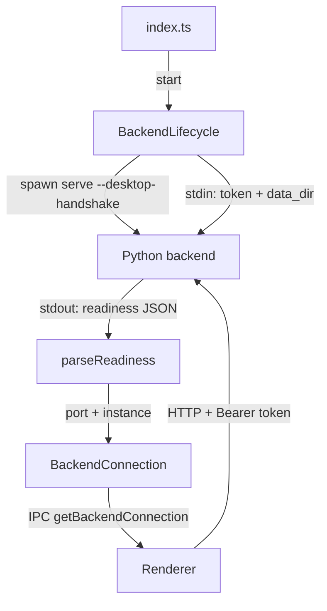

# Desktop

The Electron 43 shell packages Evidrun as a desktop app. The Main process owns lifecycle only: it spawns the Python backend, serves the built renderer over a privileged `evidrun://` protocol, brokers a small IPC surface to the renderer, and locks down the trust boundary. It implements no domain logic. For the full trust-boundary rationale see [electron security](../security/electron-security.md); this page documents the wiring.

## Directory layout

```
apps/desktop/src/
  main/
    index.ts               # app bootstrap: protocol, IPC, window, quit hooks
    backend-lifecycle.ts    # BackendLifecycle: spawn Python, stdin handshake, readiness
    desktop-handshake.ts    # parseReadiness: validate the backend readiness line
    external-links.ts       # approved external hosts + trusted renderer URLs
    permissions.ts          # lockDownPermissions: deny all permission requests
    windows.ts              # createMainWindow: hardened BrowserWindow
  preload/
    index.cts              # contextBridge exposes window.evidrunDesktop
  shared/
    desktop-contract.ts     # DesktopApi, BackendConnection/State, channel names
```

## Key abstractions

| Symbol | File | Purpose |
| --- | --- | --- |
| `BackendLifecycle` | `apps/desktop/src/main/backend-lifecycle.ts` | Spawns, tracks, restarts, and stops the Python backend |
| `parseReadiness` | `apps/desktop/src/main/desktop-handshake.ts` | Validates the backend's readiness JSON line |
| `createMainWindow` | `apps/desktop/src/main/windows.ts` | Builds the sandboxed, context-isolated window |
| `lockDownPermissions` | `apps/desktop/src/main/permissions.ts` | Denies permission checks, requests, and device access |
| `isApprovedExternalUrl` / `isTrustedRendererUrl` | `apps/desktop/src/main/external-links.ts` | Allowlists for external links and renderer origins |
| `DesktopApi` / `channels` | `apps/desktop/src/shared/desktop-contract.ts` | The IPC contract shared by main and preload |

## BackendLifecycle and the handshake

`BackendLifecycle` spawns the backend and manages its state (`starting`, `ready`, `failed`, `stopped`). On `start()`:

1. Generate a 32-byte base64url launch token and a UUID instance id.
2. Spawn the backend. Packaged: the bundled `evidrun-backend` executable from `process.resourcesPath` with `serve --desktop-handshake`. Dev: `uv run evidrun serve --desktop-handshake` from the repo root. `stdio` is piped; `env` is trimmed to `PATH` and `LANG`.
3. Write one JSON line to the child's stdin: `{ token, data_dir: userData, parent_instance_id }`.
4. Read the first stdout line, validate it with `parseReadiness`, and build the `BackendConnection` as `{ baseUrl: http://127.0.0.1:<port>, token, instanceId }`.
5. Emit `ready`. A 15s timeout kills the child and rejects if no valid readiness line arrives.

`stop()` sends `SIGTERM`, then `SIGKILL` after 4s if needed. `restart()` stops then starts. Stderr is forwarded to the console with a prefix. The launch token generated here is what the [API](api.md)'s `authorize` dependency enforces, and the same token is handed to the renderer through IPC.



## The evidrun:// protocol

Before app-ready, `evidrun` is registered as a privileged scheme (`standard`, `secure`, `supportFetchAPI`, `corsEnabled`). At startup `registerAppProtocol()` handles `evidrun://` by mapping the URL path to a file under `apps/web/dist`, defaulting `/` to `/index.html`. It resolves the target and returns 404 unless it stays within the `dist` root (path-traversal guard), otherwise serves the file via `net.fetch`. The window loads `evidrun://app/` in production, or `EVIDRUN_DEV_SERVER_URL` in dev.

## IPC and validateSender

`registerIpc()` registers handlers for the channels in `desktop-contract.ts`: app info, backend connection, backend restart, file/directory pickers, show-item-in-folder, and open-external. Every handler first calls `validateSender(senderUrl(event.senderFrame))`, which throws unless the frame URL is a trusted renderer URL (`evidrun://app` or the configured dev origin). `showItemInFolder` additionally requires an absolute string path under 4096 chars; `openExternal` requires the URL to pass the approved-host allowlist. The preload (`apps/desktop/src/preload/index.cts`) exposes exactly these as `window.evidrunDesktop` through `contextBridge`.

## Hardening

- **Window** (`windows.ts`): `nodeIntegration: false`, `contextIsolation: true`, `sandbox: true`, `webSecurity: true`, no insecure content, no experimental features. DevTools can be disabled via `EVIDRUN_DISABLE_DEVTOOLS`.
- **Permissions** (`permissions.ts`): permission check handler, permission request handler, and device permission handler all deny.
- **Navigation guards** (`index.ts`): `will-navigate` is prevented unless the target is a trusted renderer URL; `setWindowOpenHandler` denies all new windows but opens approved external URLs in the system browser.
- **External links** (`external-links.ts`): only `https:` URLs on a fixed host allowlist (electronjs.org, openai.com and related, python.org) are opened externally.

## Integration points

- Spawns the [API](api.md) via the CLI's `serve --desktop-handshake`; the readiness JSON shape must match `parseReadiness`.
- Serves the [web renderer](web.md)'s `dist` build and feeds it the backend connection through the preload bridge.
- The trust model and its threat reasoning live in [electron security](../security/electron-security.md).

## Entry points for modification

- Add an IPC capability: add a channel to `apps/desktop/src/shared/desktop-contract.ts`, a validated handler in `apps/desktop/src/main/index.ts`, and expose it in `apps/desktop/src/preload/index.cts`.
- Change backend launch: edit `spawnBackend` in `apps/desktop/src/main/backend-lifecycle.ts`; keep the token and readiness contract intact.
- Adjust allowed external hosts: edit `APPROVED_HOSTS` in `apps/desktop/src/main/external-links.ts`.

## Key source files

| Path | Role |
| --- | --- |
| `apps/desktop/src/main/index.ts` | Bootstrap, protocol, IPC, window, quit hooks |
| `apps/desktop/src/main/backend-lifecycle.ts` | Backend spawn and handshake |
| `apps/desktop/src/main/desktop-handshake.ts` | Readiness validation |
| `apps/desktop/src/main/windows.ts` | Hardened window |
| `apps/desktop/src/main/permissions.ts` | Permission lockdown |
| `apps/desktop/src/main/external-links.ts` | URL allowlists |
| `apps/desktop/src/preload/index.cts` | contextBridge API |
| `apps/desktop/src/shared/desktop-contract.ts` | IPC contract |
