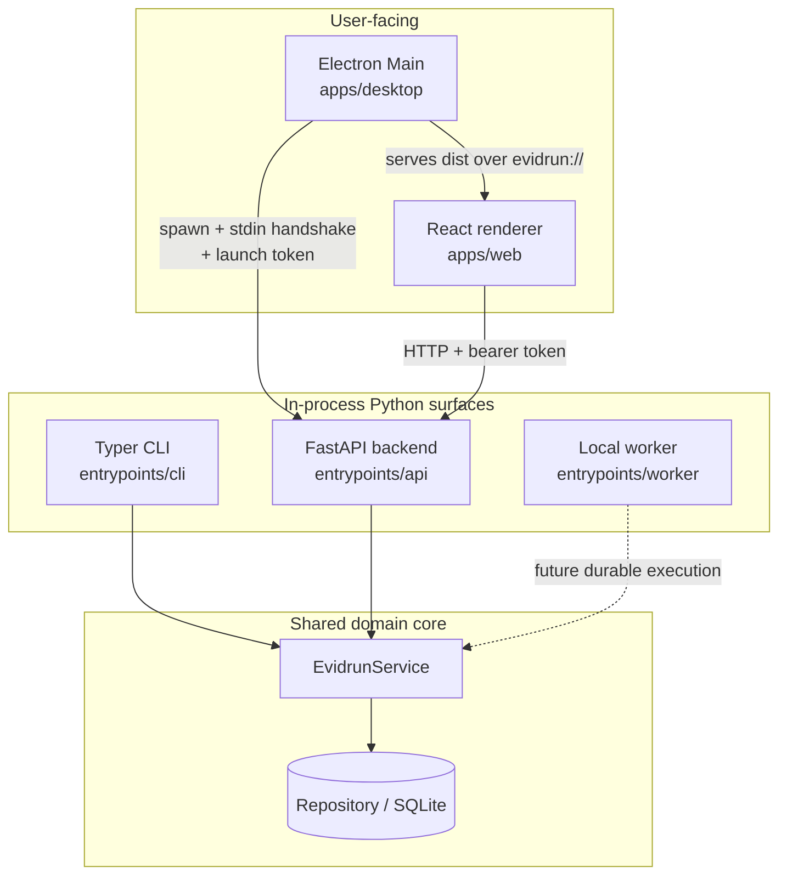

# Apps and surfaces

This lens covers the deployable, user-facing surfaces of Evidrun: the CLI, the FastAPI backend, the local worker, the React renderer, and the Electron desktop shell. Each surface is thin. It adapts the shared Python domain to a user or a machine but holds no domain rules of its own.

## The surfaces

- [CLI](cli/index.md) — a Typer command tree (`src/evidrun/entrypoints/cli/app.py`) for initializing a data directory, running the demo, compiling and admitting specs, exporting bundles, and confirming human authority offline.
- [API](api.md) — a FastAPI app (`src/evidrun/entrypoints/api/app.py`) bound to loopback. It exposes the dashboard, contract validation, study compilation, admission, runs, comparisons, chat, and bundle export.
- [Worker](worker.md) — a minimal process (`src/evidrun/entrypoints/worker/app.py`). The durable async worker is a future milestone; the deterministic spine currently runs inside the local coordinator.
- [Web](web.md) — a React 19 renderer (`apps/web/`) built with Vite, TanStack Query/Router, and Radix. It reads the dashboard and drives the demo through the API.
- [Desktop](desktop.md) — an Electron 43 shell (`apps/desktop/`) that spawns the Python backend, serves the built renderer over a privileged `evidrun://` protocol, and locks down the trust boundary.

## How the surfaces relate to the domain

Every surface reaches the same domain core through `evidrun.infrastructure.database.Repository` and `evidrun.runs.EvidrunService`. The CLI, API, and worker construct these directly in-process. The renderer never touches the domain: it calls the API over HTTP. The desktop shell owns lifecycle only — it spawns the backend and hosts the renderer, but implements no domain logic.

The dashed line marks the worker: it is reserved, not yet wired to durable execution. See [architecture](../overview/architecture.md) for the three-plane model that these surfaces sit on top of.

## Boundaries the surfaces enforce

- The domain never imports FastAPI, SQLAlchemy, OpenAI, Electron, or React. Ports live in `src/evidrun/shared/ports.py`; adapters live in `src/evidrun/infrastructure/`.
- The executable runtime is intentionally smaller than the contract surface. Tools, skills, nested agents, checkpoints, progress artifacts, human decisions without a WebAuthn verifier, and any disclosure mode other than `none` are representable but rejected at admission (fail closed). See [study to run lifecycle](../features/study-to-run-lifecycle.md).
- Human authority is never asserted by a surface. The CLI and API fail closed on contract decisions unless a trusted WebAuthn verifier completes them. See [authority](../systems/authority.md).

## Key source files

| Path | Surface |
| --- | --- |
| `src/evidrun/entrypoints/cli/app.py` | Typer CLI |
| `src/evidrun/entrypoints/api/app.py` | FastAPI backend |
| `src/evidrun/entrypoints/worker/app.py` | Local worker |
| `apps/web/src/app/Dashboard.tsx` | React renderer entry component |
| `apps/desktop/src/main/index.ts` | Electron Main process |
