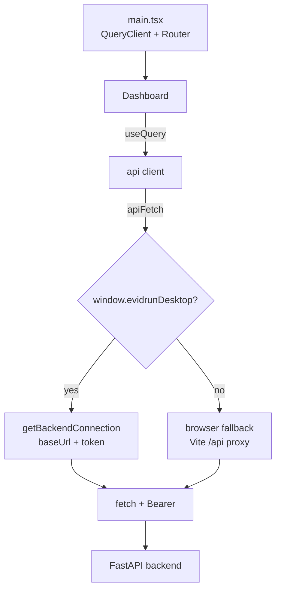

# Web

The web renderer is a React 19 single-page app built with Vite. It reads the dashboard projection from the API, drives the CRL-CTX-002 demo, and presents the paired comparison, run timeline, and generated report. It never touches the domain directly — every read and write goes over HTTP to the [API](api.md). When it runs inside the desktop shell it obtains the backend URL and bearer token through a preload bridge; in a plain browser it falls back to the Vite dev proxy.

## Directory layout

```
apps/web/
  vite.config.ts             # root, base "./", react + tailwind, dev proxy /api -> :8765
  src/
    main.tsx                 # QueryClient, TanStack Router, mounts Dashboard
    app/Dashboard.tsx        # the whole UI: EmptyState, RunPanel, ComparisonView, tabs
    api/client.ts            # apiFetch + the api object
    types.ts                 # hand-written view types (Run, Comparison, Dashboard...)
    generated/contracts.ts   # generated contract types (source of truth from domain)
    styles/index.css         # styles
```

## Key abstractions

| Symbol | File | Purpose |
| --- | --- | --- |
| `Dashboard` | `apps/web/src/app/Dashboard.tsx` | Root screen; branches on demo presence, hosts tabs |
| `EmptyState` | `apps/web/src/app/Dashboard.tsx` | Pre-demo call to action; the "Executar CRL-CTX-002" button |
| `RunPanel` | `apps/web/src/app/Dashboard.tsx` | One run card: variant, score ring, output, context facts, cited evidence |
| `ComparisonView` | `apps/web/src/app/Dashboard.tsx` | Baseline vs candidate panels, delta column, context diff |
| `api` | `apps/web/src/api/client.ts` | Typed calls: `dashboard`, `defaultProvider`, `bootstrapDemo`, `exportBundle` |
| `apiFetch` | `apps/web/src/api/client.ts` | Fetch wrapper: resolves connection, sets bearer, throws on non-2xx |
| `connection` | `apps/web/src/api/client.ts` | Caches `{baseUrl, token, instanceId}` from the desktop bridge or a browser fallback |

## How it works

`main.tsx` creates a `QueryClient` (retry 1, 5s stale time), a single-route TanStack Router mounting `Dashboard` at `/`, and wraps the tree in `QueryClientProvider` and `RouterProvider` under `React.StrictMode`.

`Dashboard` runs two queries — `dashboard` and `default-provider` — and two mutations — `bootstrapDemo` and `exportBundle`. If there are no experiments it renders `EmptyState`; the button fires the bootstrap mutation, which on success invalidates the `dashboard` query. Once an experiment exists it renders the hero row, a metric strip, and a Radix `Tabs.Root` with four tabs:

- **comparison** — `ComparisonView` for the first comparison.
- **timeline** — a per-run rail showing `run.queued`, `context.composed`, `subject.responded`, `grader.completed`.
- **report** — the comparison's `report_markdown` in a `<pre>`, with an "Exportar bundle" button that calls the export mutation.
- **chat** — UI only. It states the provider is ready but the Lab Agent flow is not implemented; the composer input and send button are disabled, labeled "em breve" (coming soon).



## The desktop bridge

The client reads `window.evidrunDesktop`, injected by the Electron preload (see [desktop](desktop.md)). `connection()` calls `getBackendConnection()` to get `baseUrl`, `token`, and `instanceId`, and caches the result. `apiFetch` sets `Authorization: Bearer <token>` whenever a token is present. `Dashboard` also subscribes to `onBackendStateChanged` to reflect backend status in the sidebar, and after a bundle export it calls `showItemInFolder(path)`. In a plain browser none of these exist, so `connection()` returns an empty `baseUrl` (relative URLs) with no token, relying on the Vite proxy to reach `127.0.0.1:8765`.

## Types: hand-written vs generated

`apps/web/src/types.ts` holds the view-facing shapes the components consume (`Run`, `Comparison`, `Experiment`, `DashboardData`, `ProviderProfile`, `BackendState`, `BackendConnection`). The canonical contract types generated from the domain live in `apps/web/src/generated/contracts.ts`. Prefer the generated types when a shape must stay in lockstep with the domain contracts.

## Vite configuration

`apps/web/vite.config.ts` sets `base: "./"` so the built bundle loads under the `evidrun://` protocol, outputs to `dist`, and in dev serves on `127.0.0.1:5173` with `strictPort` and a `/api -> http://127.0.0.1:8765` proxy. React and Tailwind plugins are enabled.

## Integration points

- Reads and writes go only to the [API](api.md); no domain import exists in the renderer.
- The build output `apps/web/dist` is what the desktop shell serves; see [desktop](desktop.md).
- The Lab Agent chat tab is intentionally inert until a `LabAgentPort` runtime exists.

## Entry points for modification

- Add a screen: register a route in `main.tsx` and add a component under `apps/web/src/app/`.
- Add an API call: extend the `api` object in `apps/web/src/api/client.ts`; reuse `apiFetch` so the bearer token and error handling stay consistent.
- Keep component data shapes aligned with `apps/web/src/generated/contracts.ts` when they mirror domain contracts.

## Key source files

| Path | Role |
| --- | --- |
| `apps/web/src/app/Dashboard.tsx` | The entire UI |
| `apps/web/src/api/client.ts` | API client and connection resolution |
| `apps/web/src/types.ts` | View types |
| `apps/web/src/main.tsx` | App bootstrap, router, query client |
| `apps/web/vite.config.ts` | Build and dev-server config |
| `apps/web/src/generated/contracts.ts` | Generated contract types |
