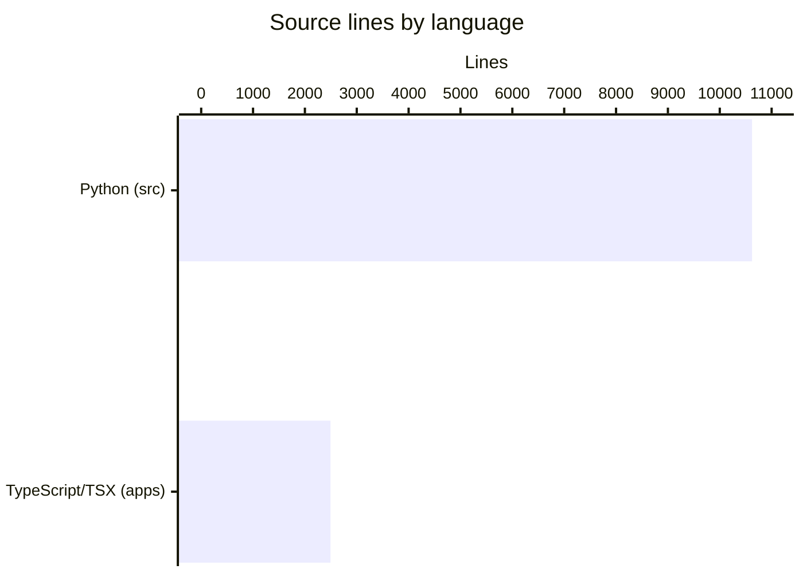

# By the numbers

Data collected on 2026-07-23.

A quantitative snapshot of the Evidrun repository at commit `1010879`. Every
figure below was measured directly from the working tree or from `git`. For the
shape of the system these numbers describe, see [architecture](overview/architecture.md).

## Size

The codebase is a Python domain core with a smaller TypeScript/TSX desktop and
web layer. Measured in lines including blanks and comments:

- Python under `src/`: 10,622 lines across 62 files.
- TypeScript/TSX under `apps/`: 2,493 lines across 20 files.

File inventory (tracked files, `node_modules` excluded):

| Category | Count | Notes |
| --- | --- | --- |
| Python source files (`src/`) | 62 | domain core |
| Python test files (`tests/`) | 17 | unit + integration |
| Config files | 11 | `.toml`, `.ini`, `.yaml`, `package.json`, `tsconfig*.json` |
| Generated schemas (`schemas/`) | 25 | JSON contract schemas |
| Markdown docs under `docs/` | 59 | tracked |
| Markdown files repo-wide | 63 | tracked |

Test-to-code ratio by file count: 17 test files to 62 source files, roughly
1 test file for every 3.6 source files.

Python files per subsystem under `src/evidrun/`:

| Subsystem | Files |
| --- | --- |
| `src/evidrun/authority/` | 11 |
| `src/evidrun/infrastructure/` | 10 |
| `src/evidrun/contracts/` | 8 |
| `src/evidrun/entrypoints/` | 7 |
| `src/evidrun/shared/` | 4 |
| `src/evidrun/subject_runners/` | 2 |
| `src/evidrun/runs/` | 2 |
| `src/evidrun/providers/` | 2 |
| `src/evidrun/experiments/` | 2 |
| `src/evidrun/evidence/` | 2 |
| `src/evidrun/evaluations/` | 2 |
| `src/evidrun/contexts/` | 2 |
| `src/evidrun/workspaces/` | 1 |
| `src/evidrun/scenarios/` | 1 |
| `src/evidrun/projects/` | 1 |
| `src/evidrun/lab_agent/` | 1 |
| `src/evidrun/conversations/` | 1 |
| `src/evidrun/comparisons/` | 1 |
| `src/evidrun/approvals/` | 1 |
| package root `src/evidrun/` | 1 |

## Activity

Five commits total, all by the same author, spread over two days:

- Jul 22 2026: 3 commits
- Jul 23 2026: 2 commits

That is 2.5 commits per day averaged over the two active days. Commit subjects,
oldest to newest:

1. `feat: initialize Evidrun context reliability lab`
2. `feat: add default provider and preserve run concepts`
3. `Document scenario-oriented Run contract discovery (#1)`
4. `Add auditable Study and Run contract foundation (#2)`
5. `feat(authority): verifiable human authority per ADR 0010 (#3)`

Churn per commit, from `git log --shortstat`:

| Commit | Files changed | Insertions | Deletions |
| --- | --- | --- | --- |
| `0fc6ef3` initialize lab | 136 | 14,862 | 0 |
| `f0c27ed` default provider | 28 | 1,373 | 14 |
| `bee188d` scenario discovery | 7 | 1,008 | 3 |
| `71f5841` Study/Run foundation | 86 | 32,073 | 729 |
| `1010879` human authority | 23 | 2,108 | 1 |

The `71f5841` foundation commit is by far the largest single change. Much of its
insertion count is generated schemas and documentation rather than hand-written
domain code.

Most-changed directories across all five commits (by file-touch count):

| Directory | Touches |
| --- | --- |
| `schemas/generated/contracts` | 23 |
| `docs/contracts` | 15 |
| `docs/adr` | 14 |
| `src/evidrun/authority` | 11 |
| `docs/product` | 9 |
| `docs/architecture` | 9 |
| `tests/integration` | 8 |
| `src/evidrun/infrastructure/database` | 8 |
| `src/evidrun/contracts` | 8 |
| `apps/desktop/src/main` | 8 |

## Bot-attributed commits

One of the five commits (`1010879`) carries a
`Co-authored-by: factory-droid[bot]` trailer, so 20% of commits show explicit
bot co-authorship. No `dependabot` or other automated-tool commits are present.

This is a lower bound. It only counts commits that spell out a bot in a
`Co-authored-by` trailer. Agent-assisted work that was committed without such a
trailer would not show up here, so the true share of machine-assisted change may
be higher.

## Complexity

Largest Python source files by line count:

| File | Lines |
| --- | --- |
| `src/evidrun/infrastructure/database/repository.py` | 1,742 |
| `src/evidrun/evidence/bundle.py` | 1,140 |
| `src/evidrun/contracts/compiler.py` | 1,134 |
| `src/evidrun/contracts/runtime.py` | 955 |
| `src/evidrun/contracts/authoring.py` | 871 |
| `src/evidrun/entrypoints/cli/app.py` | 525 |
| `src/evidrun/entrypoints/api/app.py` | 482 |
| `src/evidrun/runs/service.py` | 411 |
| `src/evidrun/contracts/legacy.py` | 359 |
| `src/evidrun/contracts/base.py` | 354 |

The top file alone holds about 16% of all Python lines under `src/`, and the top
five together hold roughly 55%. The concentration sits in `contracts/`,
`evidence/`, and the database repository, which is consistent with a system
whose weight is in contract compilation and auditable persistence.

For where these files fit in the broader design, see [overview](overview/index.md).
