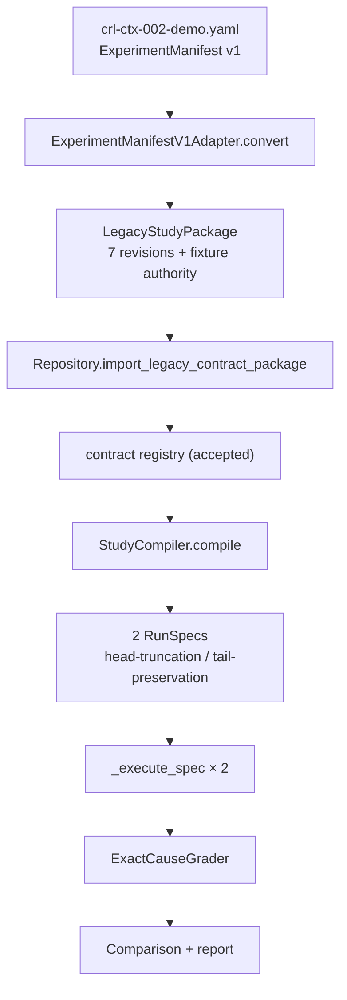

# Deterministic benchmark

`CRL-CTX-002` is the reference benchmark. It runs the full [Study to Run lifecycle](study-to-run-lifecycle.md) offline and deterministically, comparing two context policies over the same log fixture. It exists to prove the infrastructure works, not to measure any language model.

## Purpose

The scenario asks a single question: does a context policy that preserves the end of a long log keep the decisive root-cause line observable, while a policy that preserves the beginning drops it? The baseline variant keeps the head of the file and omits the marker; the candidate keeps the tail. The grader passes only when the expected cause appears in both the response and the cited evidence. Because the subject runner is a deterministic string matcher, the outcome is fixed: the tail variant passes and the head variant fails, every time, with no network and no model call.

## The fixture and the expected cause

The fixture `benchmarks/scenarios/crl-ctx-002/fixtures/long.log` is a 27-line synthetic incident log. Early lines are routine INFO/WARN traffic; the decisive line near the end is:

```text
2026-07-22T13:01:18.300Z ERROR diagnosis ROOT_CAUSE=DB_POOL_EXHAUSTED evidence=all_connections_held_by_stalled_transactions
```

The scenario's `expected` value is `DB_POOL_EXHAUSTED`. A head-truncation policy at 900 characters never reaches that line; a tail-preservation policy does. The scenario metadata (`benchmarks/scenarios/crl-ctx-002/scenario.yaml`) states its own limitations plainly: the runner is deterministic and does not represent LLM capability, and one repetition validates infrastructure, not statistical stability.

## How it bootstraps

The demo starts from a legacy `ExperimentManifest` v1 document (`benchmarks/experiments/crl-ctx-002-demo.yaml`), not from hand-authored revisions. `EvidrunService.bootstrap_demo(benchmark_root)` in `src/evidrun/runs/service.py` runs the whole thing:



1. **Load.** The manifest is parsed as `ExperimentManifest` (`src/evidrun/experiments/models.py`) and the `long.log` fixture bytes are read.
2. **Adapt.** `ExperimentManifestV1Adapter.convert` (`src/evidrun/contracts/legacy.py`) translates the manifest into a `LegacyStudyPackage`: a goal, a scenario with one `subject_and_evaluator` input binding, an agent inventory naming the `scripted-log-investigator` runner, an `in_process` workspace with `network=disabled`, a `single_turn` interaction, a one-stage deterministic evaluation plan carrying `expected=DB_POOL_EXHAUSTED`, and the Study itself. `capability_ref` derives each capability descriptor's digest from its namespace/name/version.
3. **Import.** `import_legacy_contract_package` is the only write path that accepts a `RepositoryFixtureDecisionAuthority`. It accepts the complete canonical `CRL-CTX-002` package, checks the closed list of revisions and refs, and requires every acceptance decision to cover the exact package digest. This authority is explicitly non-human; see [human authority](human-authority.md).
4. **Compile.** The Study compiles into two RunSpecs, one per variant. The baseline variant applies no override (it inherits the blueprint's `preserve-head-v1` policy); the candidate overrides the context policy to `preserve-tail-v1`. The comparison's primary variable is `context_policy`, and because the two variants differ in exactly that slot, the `prospective_controlled` check passes.
5. **Execute.** `_execute_spec` runs each spec, emitting the full event sequence and composing the context snapshot with the variant's policy.
6. **Grade.** `ExactCauseGrader` (`src/evidrun/evaluations/deterministic.py`) passes only when `DB_POOL_EXHAUSTED` appears in both output and evidence.
7. **Compare.** The two grades and the classified context diff become a `Comparison` with a report that states in writing that the deterministic runner verifies infrastructure, not model ability.

## Why it is offline and deterministic

Every input is fixed: a checked-in fixture, a scripted subject that greps a `ROOT_CAUSE=` marker rather than calling a provider, `network=disabled` in the workspace, and `SeedStrategy=deterministic`. There is no clock-dependent or model-dependent behavior in the executable path, so the same inputs always produce the same event ledger, grades, and digests. That determinism is what lets CI verify the whole pipeline — compilation, admission, the event chain, evaluation anchoring, and bundle verification — without any external dependency.

## What it proves and does not prove

It proves the infrastructure works: the lifecycle wires together correctly, admission admits exactly the supported shape, the event ledger chains and phase-gates correctly, an evaluation anchors to the ledger, a controlled comparison isolates one variable, and an evidence bundle verifies. It does not prove anything about a model's capability. The subject is a deterministic matcher, so a "pass" only means the decisive evidence was inside the composed context window, and a single repetition says nothing about statistical stability. The benchmark protocol (`docs/benchmarks/protocol.md`, surfaced through [run execution](../systems/run-execution.md)) reserves limited causal language for `prospective_controlled` comparisons with a single isolated variable, which is exactly this scenario's shape.

## Systems and primitives involved

- Systems: [run execution](../systems/run-execution.md), [context composition](../systems/context-composition.md), [contracts / compiler](../systems/contracts/compiler.md), [evidence](../systems/evidence.md).
- Primitives: [contracts and revisions](../primitives/contracts-and-revisions.md), [RunSpec and admission](../primitives/runspec-and-admission.md), [events](../primitives/events.md).

## Current limits

The benchmark is the single lifecycle path the runtime executes. It uses the legacy import as its bootstrap because there is no UI or CLI flow yet for authoring and accepting the seven revisions by hand with verified human authority. The scenario is deliberately trivial for the subject; it is a smoke test of the machinery, tagged `deterministic-smoke` and `p0`, not a model evaluation.

## Entry points

| Concern | Code / file |
| --- | --- |
| Demo orchestration | `EvidrunService.bootstrap_demo` in `src/evidrun/runs/service.py` |
| Manifest model | `ExperimentManifest` in `src/evidrun/experiments/models.py` |
| Legacy adapter | `ExperimentManifestV1Adapter`, `capability_ref` in `src/evidrun/contracts/legacy.py` |
| Manifest document | `benchmarks/experiments/crl-ctx-002-demo.yaml` |
| Scenario + fixture | `benchmarks/scenarios/crl-ctx-002/scenario.yaml`, `.../fixtures/long.log` |
| Subject runner | `ScriptedLogInvestigator` in `src/evidrun/subject_runners/scripted.py` |
| Grader | `ExactCauseGrader` in `src/evidrun/evaluations/deterministic.py` |
| Run it | `evidrun demo` (CLI) or `POST /api/v1/demo/bootstrap` (API) |
