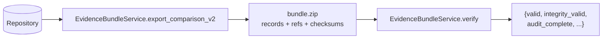

# Evidence bundles

An evidence bundle is a self-contained ZIP that packages a comparison and everything needed to re-verify it: the runs, their contracts, the event ledgers, evaluations, checkpoints, and an artifact manifest, all keyed by digest. A third party can recompute every identity and replay every event chain without trusting the exporter. This page covers the capability across the CLI and API; for the verifier internals, see [systems / evidence](../systems/evidence.md).

## Purpose

A run's conclusion is only as good as the evidence behind it. A bundle turns a completed comparison into a portable audit artifact that stands on its own: verification re-derives every digest, replays every event chain against the phase rules, and (for v2) re-validates every contract, record, and manifest entry. A checksum match alone is never treated as sufficient.

## How it works

Export reads a comparison and its two runs from the repository, dumps each record with its computed digest appended, derives the expected artifact manifest, and writes a checksum for every file. Verify re-parses everything from the ZIP and recomputes it independently, deliberately re-deriving rather than trusting stored digests.

## Bundle v1 versus v2

`export_comparison` writes the original flat v1 layout: `manifest.json`, `comparison.json`, `grades.json`, `report.md`, one `events/{run}.jsonl` per run, and `checksums.json`. It is a straightforward snapshot with no contract re-verification. It stays exportable for compatibility through an explicit flag.

`export_comparison_v2` is the auditable layout and the default for new exports. It requires Study-based runs (it raises if a run has no contracts) and adds the full contract composition: `bundle.json` (the header), `run-specs/`, `admissions/`, `runs/`, `evaluations/`, `checkpoints/`, `contracts/{type}/{logical_id}@{revision}.json` for every referenced revision, and `artifact-manifest.json`. Each record is dumped with its digest appended so the verifier can recompute and compare it.

## The audit / references-only profile

A v2 bundle's header declares `profile="audit"`, `artifact_content="references_only"`, `portable=false`, and `replayable=false`. It carries record identities and digests, not artifact bytes. It can contain refs without their blobs or grants, so it deliberately does not promise full offline portability, artifact materialization, restore, or replay. Those would need a future `portable` export with a completeness manifest and grants, and replay would need its own contract and a new run. No bundle includes a credential value or a resolved secret binding.

## The artifact manifest

`artifact-manifest.json` enumerates the artifacts a run intentionally materialized — scenario inputs, subject-input materialization, agent instructions, interaction prompts, hidden calibration, extension schema and payload, and checkpoint captures — each as an `ArtifactManifestEntry` with `content_included=false` and an omission reason stating the audit profile carries identity and digest, not bytes. It is a declaration of intentional references, not telemetry of every file read, edited, or observed during the run. Verify recomputes the expected entry set from the parsed RunSpecs and checkpoints and requires the stored manifest to match exactly, with a matching digest and the non-portable, non-replayable flags intact. See [artifacts](../primitives/artifacts.md).

## What verification checks

`verify(bundle_path)` returns `valid`, `integrity_valid`, `audit_complete`, the fixed `portable`/`replayable` flags, and per-check maps for checksums, event chains, and records. A bundle is `valid` only when every checksum, every event chain, and every record check passes:

- **Checksums** — every listed file present with a matching SHA-256, the file list complete with no extras or omissions, and member names unique.
- **Event chains** — each ledger replayed from `run.queued`: correct schema version, run id, and monotonic sequence; allowed actor; no reserved event type; `prev_event_hash` and recomputed `event_hash` matching; payload reproduced exactly by `normalize_event_payload`; a legal lifecycle transition; paired subject invoke/respond; and nothing after a terminal event.
- **Records (v2)** — the header flags and two distinct run ids; each `RunRecord` cross-checked against its RunSpec digest, admission digest, admitted decision, and lineage; every referenced contract re-parsed and its digest recomputed against the spec's embedded payload; the artifact manifest matching the recomputed expected set; evaluation records validated through `EvaluationValidator` and matched to their completion events; checkpoint records matched to their definition, validators, capture, and boundary; and the comparison's run ids matching the header.

## The surfaces

- **CLI** — `bundle export <comparison_id>` writes a v2 bundle (or v1 with `--legacy-v1`) to `--output` or `<data>/exports/<id>.evidrun.zip`; `bundle verify <path>` verifies a bundle in a scratch database and prints the result JSON, exiting 1 if invalid. See the [CLI command reference](../apps/cli/command-reference.md).
- **API** — `POST /api/v1/evidence-bundles/{comparison_id}` exports a v2 bundle off-thread and returns the file path. See the [API surface](../apps/api.md).

Both go through the same `EvidenceBundleService` and the same `Repository` as the rest of the domain.

## Systems and primitives involved

- Systems: [evidence](../systems/evidence.md), [database](../systems/database.md), [contracts / runtime](../systems/contracts/runtime.md).
- Primitives: [artifacts](../primitives/artifacts.md), [events](../primitives/events.md), [evaluation and checkpoints](../primitives/evaluation-and-checkpoints.md).

## Current limits

Only the audit / references-only profile exists. Bundles are not portable and not replayable, they carry no blobs and no grants, and the v2 layout does not include the materialized `SubjectEnvelope` as its own record — so although `subject.invoked` carries the envelope's claimed digest, the verifier cannot recompute that digest from the bundle. A portable profile and executable replay are future work with their own contracts.

## Entry points

| Concern | Code |
| --- | --- |
| Export + verify | `EvidenceBundleService` in `src/evidrun/evidence/bundle.py` |
| Manifest model | `ArtifactManifest`, `ArtifactManifestEntry` in `src/evidrun/contracts/base.py` |
| Event tables + normalize | `EVENT_ALLOWED_RUN_STATUSES`, `UNSUPPORTED_RUNTIME_EVENT_TYPES`, `normalize_event_payload` in `src/evidrun/contracts/runtime.py` |
| CLI | `bundle export` / `bundle verify` in `src/evidrun/entrypoints/cli/app.py` |
| API | `POST /api/v1/evidence-bundles/{comparison_id}` in `src/evidrun/entrypoints/api/app.py` |
