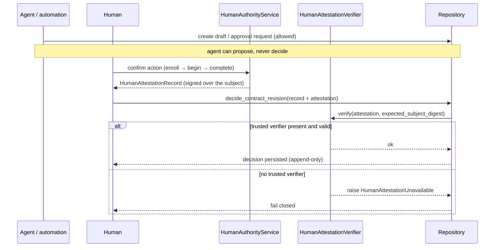

# Human authority

Some actions in Evidrun can only be taken by a real, verified human: accepting, rejecting, or superseding a contract revision; recording a human review or adjudication of an evaluation; and authorizing an external effect. This page covers the cross-cutting policy and flow. For the code mechanics of enrollment, the confirmation ceremony, and verification, see [systems / authority](../systems/authority.md).

## The invariant

From `AGENTS.md` and [ADR 0010](../background/design-decisions.md): an agent, automation, or service can create a draft and an approval request, but it can never claim to be human, fill in a decision on the human's behalf, or turn an actor field into proof of authority. Human authority requires a verified `HumanAttestationRecord`. Without a trusted verification adapter, the API, CLI, and repository fail closed — the operation is refused, not downgraded to a weaker authority.

The origin of this rule matters. An earlier design restricted an event's `actor_type` to the literal `human`, but that only validated a claim in a payload. Setting `actor_type=human` proves nothing; it means `human_asserted`, never `verified_human`. Authority now comes from a cryptographic attestation bound to a specific principal, action, and content digest, not from a self-reported field.

## How it works

The human confirms a `HumanSubjectEnvelope` — a closed, versioned contract that is the single source of truth for exactly what was signed. `RevisionDecisionSubject` covers `{revision_ref, decision, rationale}`; `EvaluationDecisionSubject` covers the evaluation's run, plan, stage, evaluator, boundary, dimension values, gate, and relation. The envelope computes `subject_digest()`, and an anti-drift test requires it to be byte-for-byte equal to the record's `human_subject_digest()`, so the digest the human signs cannot silently diverge from the digest the kernel validates. See [ADR 0015](../background/design-decisions.md).

When the record reaches the repository, the injected `HumanAttestationVerifier` re-checks that the attestation's action, target digest, subject digest, and timestamp all line up with the record content before anything is persisted. The write is append-only: an adjudication references the records it judges and declares precedence, but never overwrites a prior grader, judge, or review record.

## Review versus adjudication

The evaluation model keeps two human actions distinct, both requiring verified authority:

- **Human review** (`human_reviewer`) is a primary human evaluation declared as a stage of the plan. It carries an `independent_review` relation and does not need to supersede any other record.
- **Adjudication** (`human_adjudicator`) is a later decision about precedence between existing records. It carries an `adjudicates` relation with explicit targets, must reference records from the same run, plan, and stage, and must be authorized by the plan's `HumanAdjudicationPolicy`.

Both are final, append-only, and require a validated attestation.

## The repository_fixture exception

There is exactly one non-human authority: `RepositoryFixtureDecisionAuthority`. It exists so the [deterministic benchmark](deterministic-benchmark.md) can be imported without a human ceremony, and it is explicitly not a proof of human action. The common decision path always rejects it. The only write path that accepts it is `Repository.import_legacy_contract_package`, which admits solely the complete canonical `CRL-CTX-002` package, checks the closed list of revisions and refs, requires every decision to cover the exact package digest, and rejects a placeholder fixture digest. It can only carry `accepted`.

## Systems and primitives involved

- Systems: [authority](../systems/authority.md), [contracts](../systems/contracts/index.md), [database](../systems/database.md).
- Surfaces: the [API](../apps/api.md) `POST /api/v1/contracts/revisions/{id}/decisions` returns 503 (fail closed) unless a trusted verifier is wired; the [CLI](../apps/cli/command-reference.md) `contract accept` refuses and points to `authority accept`, which runs the offline confirmation ceremony.
- Primitives: [contracts and revisions](../primitives/contracts-and-revisions.md), [evaluation and checkpoints](../primitives/evaluation-and-checkpoints.md).

## Current limits

The trusted adapter shipped today is a local software authenticator (`KeyringAuthenticator`) with EC P-256 keys, gated behind `EVIDRUN_AUTHORITY=1`. With the flag off, the process verifier stays `UnavailableHumanAttestationVerifier` and every human decision fails closed, which is the default. There is no real WebAuthn/passkey hardware adapter, no credential recovery or rotation (revocation is terminal), and no UI ceremony yet. Human authorization of an external effect is treated as critical by the policy but has no record type or runtime. A Study whose evaluation plan requires human adjudication is rejected at admission as `runtime:verified_human_adjudication`; the runtime never starts a run that would later pretend to have received adjudication.

## Entry points

| Concern | Code |
| --- | --- |
| Attestation record + decision record | `HumanAttestationRecord`, `RevisionDecisionRecord`, `DecisionAuthority` in `src/evidrun/contracts/base.py` |
| Fail-closed verifier | `UnavailableHumanAttestationVerifier`, `HumanAttestationVerifier` in `src/evidrun/contracts/authority.py` |
| Ceremony + verification | `src/evidrun/authority/*` (see [systems / authority](../systems/authority.md)) |
| Legacy exception | `Repository.import_legacy_contract_package`, `RepositoryFixtureDecisionAuthority` |
| Surfaces | `contract accept` / `authority accept` in the CLI; the decisions route in `src/evidrun/entrypoints/api/app.py` |
