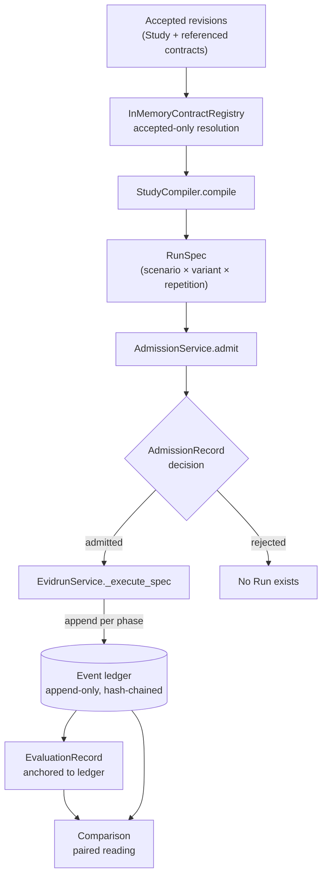

# Study to Run lifecycle

This is the canonical flow the whole project is built around: an accepted Study revision becomes one or more immutable RunSpecs, each spec is admitted or rejected against the runtime, an admitted spec runs, the run produces an append-only event ledger, an evaluation record anchors to that ledger, and a comparison reads two runs against each other. Every step is content-addressed, and the boundary between what compiles and what runs is enforced at admission.

## Purpose

Prompt, context, and policy changes are usually justified by a single lucky example. The lifecycle turns a hypothesis into a versioned, auditable pipeline: the exact contracts are frozen and hashed, the runtime refuses anything it cannot honor, and the resulting evidence points back at the ledger sequence and hash that produced it. Nothing downstream becomes a fact without a `run:`, `event:`, or `artifact:` reference.

## How it works

### 1. Authoring and acceptance

A human authors the nine revision types (`StudyRevision` and the contracts it references) as frozen `RevisionEnvelope` models. A revision is content-addressed and immutable; a correction is a new revision, never a mutation of an accepted one. Acceptance is a `RevisionDecisionRecord` that requires verifiable human authority — see [human authority](human-authority.md). Only accepted revisions can be resolved by the compiler. See [contracts and revisions](../primitives/contracts-and-revisions.md).

### 2. Compilation into RunSpecs

`StudyCompiler.compile(study)` in `src/evidrun/contracts/compiler.py` resolves the Study ref through an `InMemoryContractRegistry` that returns a revision only if the reference digest matches and the revision has an accepted decision. It validates the comparison plan, then produces one `RunSpec` for every `(scenario_ref, variant, repetition_index)` combination. `_materialize` applies each variant's overrides slot by slot on top of the run blueprint, resolves every ref with a type check, validates extensions, and assembles the spec. A `RunSpec` embeds both the ref and the resolved payload for each slot, so its digest content-addresses the entire execution configuration. See [RunSpec and admission](../primitives/runspec-and-admission.md) and [compilation and admission](../systems/contracts/compiler.md).

### 3. Admission — the fail-closed gate

`AdmissionService.admit(spec)` decides whether the active runtime can run the spec exactly as written. It accumulates missing requirements, denied policies, and blocking issues, then returns an `AdmissionRecord` whose decision is `rejected` if anything blocks and `admitted` otherwise. The record's own validator re-derives whether it is blocked and refuses to claim `admitted` while blocked, so an admission record cannot lie about its own decision.

Admission is where the runtime's deliberate narrowness lives. It rejects, among other things: any interaction mode other than `single_turn`; any workspace other than `in_process` with read-only mounts; `sensitive` or `restricted` inputs; disclosure other than `none`; `raw_encrypted` capture; any tool, skill, checkpoint, or progress-artifact policy; `bounded_exploration` goals; any evaluation shape other than a single deterministic boolean grader; and any budget other than `max_wall_seconds`. Each rejection is a structured `AdmissionIssue` with a category and reason code. No Run exists before an `AdmissionRecord` with `decision=admitted` for the exact RunSpec digest.

### 4. Run execution

For an admitted spec, `EvidrunService._execute_spec` in `src/evidrun/runs/service.py` walks the phases and appends one event per phase through the repository's state machine. It composes the context snapshot, invokes the scripted subject runner under an `asyncio.wait_for` bounded by `max_wall_seconds`, records the response with the exact capture shape the policy declares, grades the response, and appends the terminal event. Every `append_event` advances `RunRow.status` in the same transaction, but the ledger — not the status column — is the normative record. See [run execution](../systems/run-execution.md).

### 5. Event ledger

Each event carries a `sequence`, a `prev_event_hash`, and an `event_hash` computed over the full envelope. Because each event commits to its predecessor's hash, the sequence is a tamper-evident chain. Events are phase-gated: a type is valid only in the run statuses its `EVENT_ALLOWED_RUN_STATUSES` entry permits, and reserved types (pause/resume, tool, skill, checkpoint, progress) are rejected until their coordinators exist. See [events](../primitives/events.md).

### 6. Evaluation

After the subject responds, the deterministic grader produces an `EvaluationRecord` whose `EvaluationBoundary` points at the `subject.responded` event's sequence and hash. The record carries a boolean `DimensionValue` with an `event:` evidence ref. `evaluation.completed` must reference the exact persisted record, and `run.completed` must cover the stages the evaluation plan requires. Evaluation records are append-only; a correction is a new record. See [evaluation and checkpoints](../primitives/evaluation-and-checkpoints.md).

### 7. Comparison

`bootstrap_demo` builds a `Comparison` from two runs' grades and the classified context diff between their snapshots. A `prospective_controlled` comparison is only valid when the two variants differ in exactly the declared primary variable; the compiler enforces that at compile time. The comparison is a projection — the ledger remains the source of truth.

## Systems and primitives involved

- Systems: [contracts / compiler](../systems/contracts/compiler.md), [contracts / runtime](../systems/contracts/runtime.md), [run execution](../systems/run-execution.md), [context composition](../systems/context-composition.md), [database](../systems/database.md), [evidence](../systems/evidence.md), [authority](../systems/authority.md).
- Primitives: [contracts and revisions](../primitives/contracts-and-revisions.md), [RunSpec and admission](../primitives/runspec-and-admission.md), [events](../primitives/events.md), [evaluation and checkpoints](../primitives/evaluation-and-checkpoints.md).

## Current limits

The executable slice of this lifecycle is one path: a scripted deterministic subject, `single_turn`, `in_process`, `max_wall_seconds`, one deterministic boolean grader. Everything else in the contracts — tools, skills, nested agents, graph interaction, checkpoints, progress artifacts, bounded exploration, model judges, human review pipelines, non-`none` disclosure — compiles into a valid RunSpec but is rejected at admission, so no Run is ever created for it. There is no general run coordinator, no worker leasing, and no generic execution of arbitrary evaluation-plan stages. The [deterministic benchmark](deterministic-benchmark.md) is the one lifecycle instance that runs today.

## Entry points

| Step | Code |
| --- | --- |
| Acceptance | `InMemoryContractRegistry.decide`, `Repository.decide_contract_revision` |
| Compile | `StudyCompiler.compile` / `_materialize` in `src/evidrun/contracts/compiler.py` |
| Admit | `AdmissionService.admit` in `src/evidrun/contracts/compiler.py` |
| Execute | `EvidrunService._execute_spec` in `src/evidrun/runs/service.py` |
| Ledger | `Repository.append_event`, tables in `src/evidrun/contracts/runtime.py` |
| Evaluate | `ExactCauseGrader` in `src/evidrun/evaluations/deterministic.py` |
| Compare | `EvidrunService.bootstrap_demo` in `src/evidrun/runs/service.py` |
