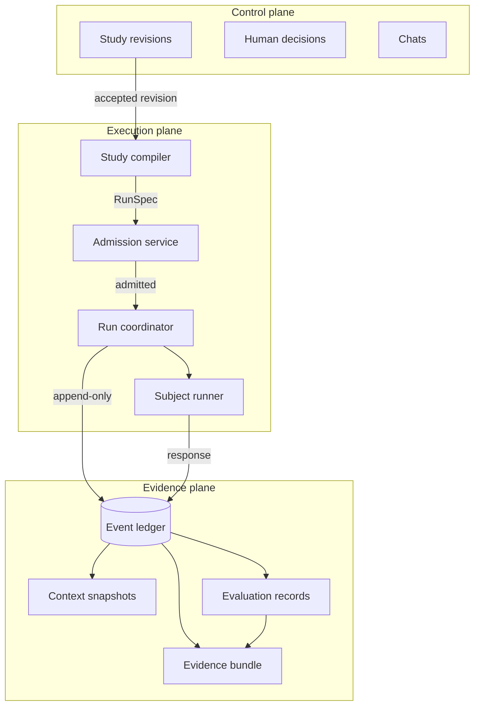
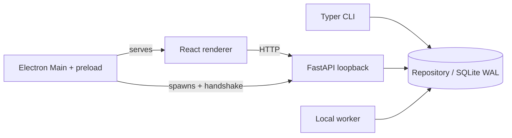
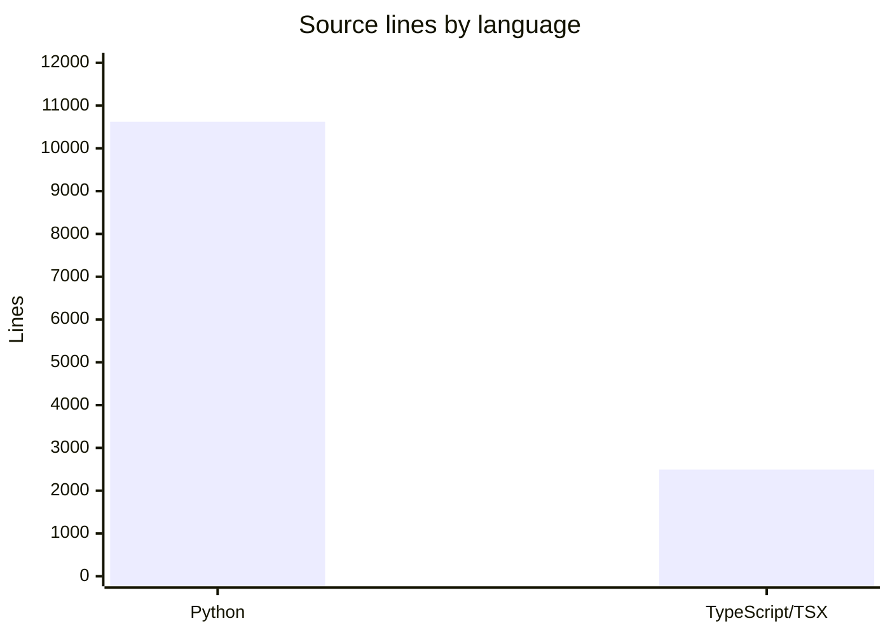

# Architecture

Evidrun is a modular monolith organized around three planes. A Python domain core holds all rules, and thin surfaces (CLI, FastAPI, worker, React, Electron) adapt that core to users and machines. SQLite is the canonical local store; JSONL and evidence bundles are exports.

## The three planes

- **Control plane** — projects, Studies, contract revisions, human decisions, and chats. The Lab Agent's role is defined but its runtime does not exist yet.
- **Execution plane** — the compiler, admission, coordinator, worker, subject runner, and workspace.
- **Evidence plane** — the event ledger, context snapshots, artifacts, checkpoints, evaluations, and bundles.

## The canonical flow

The new flow is `accepted StudyRevision → compilation → RunSpec → admission → Run → events`. Revisions, specs, and admissions are immutable. Checkpoints and evaluations anchor to a ledger sequence and hash. Status, comparison, grade, report, and graph remain projections.

`RunRow.status` is an operational cache. The repository validates the state machine and advances the column in the same transaction that writes each lifecycle event; `update_run` does not accept a direct status change. The event ledger stays the normative authority and lets you verify or reconstruct the projection. See [run execution](../systems/run-execution.md) and [evidence](../systems/evidence.md).

## Event discipline

Factual events are accepted only in the allowed phase and only with their canonical records linked. Subject invocations and responses are paired; evaluation only starts after a response; `evaluation.completed` points to the exact EvaluationRecord; and `run.completed` requires the records and stages the EvaluationPlan demands. Events for pause/resume, tools, skills, checkpoints, and progress artifacts stay reserved and are rejected until their coordinators exist. The [Run Event contract](../primitives/events.md) defines the phase rules.

## Surfaces

Electron manages the backend lifecycle but contains no domain rules. React uses the same API in the browser and inside the desktop app. The domain never imports FastAPI, SQLAlchemy, OpenAI, Electron, or React; those boundaries are enforced by convention and reviewed against `AGENTS.md`. See [apps](../apps/index.md) for each surface.

## Ports and adapters

The domain talks to the outside world through protocols defined in `src/evidrun/shared/ports.py`: `SubjectRunnerPort`, `ProviderPort`, `GraderPort`, `EventSink`, `ArtifactStorePort`, `LabAgentPort`, and others. Concrete adapters live under `src/evidrun/infrastructure/`. This keeps the domain testable and provider-neutral. Several ports (tools, approvals, trace import/export, Lab Agent) are declared but have no active runtime.

## What is intentionally not executable yet

At the current stage the coordinator runs the deterministic runner locally through the new pipeline. The runtime admits only `single_turn`, `in_process` workspace, and cataloged capabilities. A graph protocol is typable and compilable but rejected at admission. The worker interface is a separate surface, but leases and durable async execution belong to the next milestone. Generic execution of all EvaluationPlan stages does not exist: the demo runs only its deterministic grader; order and hard gates are validated when EvaluationRecords are persisted.

Admission also fails closed for: the checkpoint coordinator, the progress artifact observer, evaluation pipelines beyond the supported deterministic grader, required human adjudication, dynamic disclosure, and the bounded-exploration terminal. Human decisions have a schema and verifier protocol, but the API and CLI refuse the flow until a trusted WebAuthn adapter is installed. See [human authority](../features/human-authority.md) and [background: design decisions](../background/design-decisions.md).

## Language stack

The domain and all execution logic are Python 3.14 (FastAPI, Pydantic, SQLAlchemy, SQLite/WAL). The web renderer is React 19 with TanStack Query and Router; the desktop shell is Electron 43. See [by the numbers](../by-the-numbers.md) for the full snapshot.
