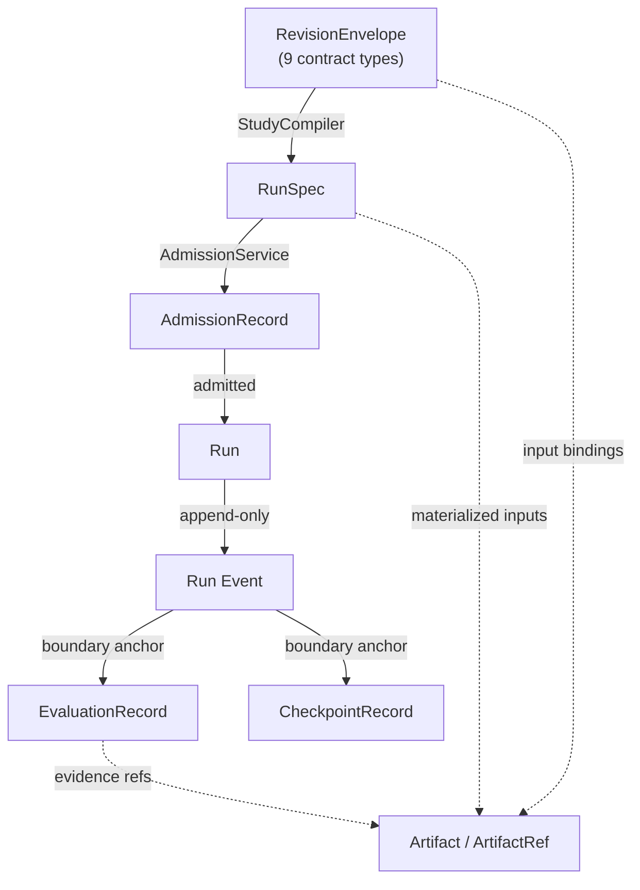

# Primitives

Primitives are the foundational domain objects Evidrun is built from. These pages describe each one at the concept level — what it is, its fields, its invariants, and where it lives in code. They complement the code-level [systems / contracts](../systems/contracts/index.md) pages: read a primitive page to understand what an object means, and the matching systems page to see exactly how it is implemented and validated.

Every primitive is a frozen, content-addressed Pydantic model. Identity is the SHA-256 of the model's canonical JSON, and references carry that digest so a mismatch is detectable anywhere in the pipeline. See [patterns and conventions](../how-to-contribute/patterns-and-conventions.md) for the shared rules.

## The core objects

- [Contracts and revisions](contracts-and-revisions.md) — the immutable authoring layer: `RevisionEnvelope`, `ContractType`, digests, and the accepted/proposed/draft lifecycle.
- [RunSpec and admission](runspec-and-admission.md) — the compiled, atomic execution config and the pre-queue admission decision that gates it.
- [Events](events.md) — the append-only, hash-chained, phase-gated Run event ledger.
- [Evaluation and checkpoints](evaluation-and-checkpoints.md) — anchored, append-only results: `EvaluationRecord`, gates, human review versus adjudication, `CheckpointRecord`, and bounded-exploration terminals.
- [Artifacts](artifacts.md) — content identity by digest with no storage locator, classification, the manifest, and the progress artifact.

## How they relate

Revisions are authored and accepted, the compiler turns an accepted Study into RunSpecs, admission decides each spec, an admitted spec becomes a Run, the Run emits an event ledger, and evaluations and checkpoints anchor to points in that ledger. Artifacts thread through all of it as content identities, never as access grants. The [Study to Run lifecycle](../features/study-to-run-lifecycle.md) walks this chain as a workflow.
