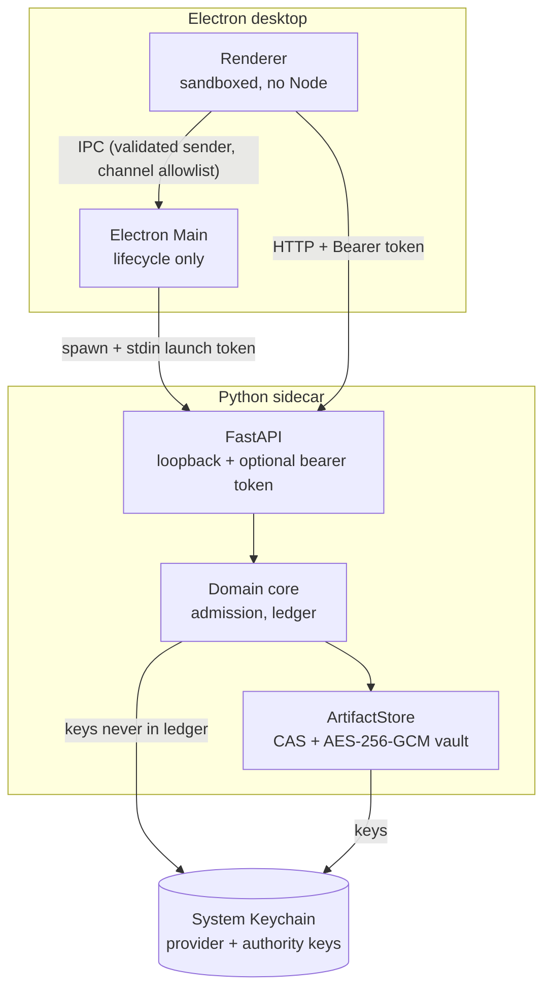

# Security

Evidrun is local-first and holds sensitive material: raw prompts and responses, artifacts, provider keys, the event ledger, and human authority. The security model is built around a few trust boundaries and a fail-closed posture: when a control cannot be enforced, the operation is rejected rather than downgraded. This section documents those boundaries. The normative source is `docs/security/threat-model.md`.

## Assets and boundaries

The threat model names the assets as sensitive raw content, prompts, responses, artifacts, provider keys, the event ledger, and human authority. The boundaries it defends are renderer/Main, Main/sidecar, API/client, Lab Agent/Subject Agent, runner/tool environment, and data store/external export.

## The controls

- **Loopback-only API with optional launch-token auth.** The FastAPI app binds `127.0.0.1`. When Electron spawns it with `--desktop-handshake`, it passes a 32-byte launch token over stdin, and the API's `authorize` dependency rejects any request without `Authorization: Bearer <token>` (401). Plain `evidrun serve` has no token and accepts any local process on loopback, which the threat model calls out explicitly. See [Electron security](electron-security.md).
- **Electron isolation.** The renderer runs with `contextIsolation: true`, `sandbox: true`, `nodeIntegration: false`, no remote content, a channel-allowlisted IPC surface with sender validation, denied device permissions, and an external-link allowlist. See [Electron security](electron-security.md).
- **Secrets in the Keychain.** Provider API keys live in the system Keychain (or an ephemeral `EVIDRUN_PROVIDER_API_KEY` for CI), never in code, docs, the ledger, bundles, or logs. The API returns the provider profile without the credential; `tests/integration/test_api.py` asserts the key never leaks. Authority keypairs are held in the OS keystore too.
- **Artifact classification and encryption.** Every artifact and input carries a `Classification`. Sensitive raw content is opt-in and encrypted with AES-256-GCM in a vault; restricted content is never persisted. `ArtifactRef` carries a classification but no storage locator: a reference identifies content, it does not grant access. See [privacy and retention](privacy-and-retention.md).
- **Verifiable human authority, fail-closed.** A human action is only "verified" when bound to an authenticated principal and explicit confirmation evidence. Without a trusted verifier the API, CLI, and repository fail closed rather than trusting a claimed actor field. See [systems: authority](../systems/authority.md) and [background: design decisions](../background/design-decisions.md).

## What the controls do not yet cover

The threat model is honest about the gaps. Plain `evidrun serve` is unauthenticated on loopback. Context Snapshots, most event payloads, and free-text strings do not yet go through the ArtifactStore or secret scanning. `ArtifactRef` grant/materialization enforcement does not exist. An auditable bundle does not imply portable blobs or replay. A code sandbox, sync, and the Lab Agent's authority will each need their own threat-model revision. Do not describe any of these as implemented.

## Sub-pages

- [Electron security](electron-security.md) — the desktop trust boundary in detail.
- [Privacy and retention](privacy-and-retention.md) — classification, encryption, and data deletion.
