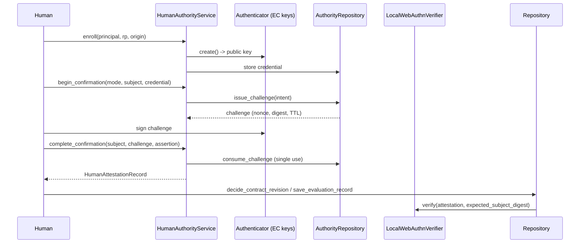

# Authority

`src/evidrun/authority/` is the code that lets a real human — never an agent — authorize a critical action. It enrolls credentials, runs a two-step confirmation ceremony, and produces a `HumanAttestationRecord` that downstream repositories verify before persisting a revision decision or a human evaluation. This page covers the mechanics; for the cross-cutting flow and why it exists, see [human authority](../features/human-authority.md).

The central invariant, from `AGENTS.md`: an agent, automation, or service can create a draft and an approval request, but human authority requires a verified `HumanAttestationRecord`, and without a trusted adapter the API, CLI, and repository fail closed.

## Directory layout

| File | Purpose |
| --- | --- |
| `src/evidrun/authority/service.py` | `HumanAuthorityService` — enrollment, confirmation, attestation. |
| `src/evidrun/authority/policy.py` | `AuthorityPolicy`, `AuthorityMode`, `ActionRisk`, critical-action set. |
| `src/evidrun/authority/subject.py` | `RevisionDecisionSubject`, `EvaluationDecisionSubject` — the exact signed content. |
| `src/evidrun/authority/challenge.py` | `ConfirmationIntent` and the challenge digest. |
| `src/evidrun/authority/authenticator.py` | `KeyringAuthenticator`, `MemoryAuthenticator` — local software authenticators. |
| `src/evidrun/authority/crypto.py` | EC key handling and WebAuthn-style assertion sign/verify. |
| `src/evidrun/authority/verifier.py` | `LocalWebAuthnVerifier` — validates assertions against enrolled keys. |
| `src/evidrun/authority/repository.py` | `AuthorityRepository` — credential and challenge persistence. |
| `src/evidrun/authority/models.py` | `HumanCredentialRow`, `HumanChallengeRow`. |
| `src/evidrun/authority/router.py` | FastAPI router for the enroll/confirm/decide endpoints. |
| `src/evidrun/authority/__init__.py` | Public re-exports. |

The `HumanAttestationRecord` itself and the fail-closed `HumanAttestationVerifier` protocol live in the contracts package (`src/evidrun/contracts/base.py` and `src/evidrun/contracts/authority.py`); see [contracts](contracts/index.md).

## HumanAuthorityService

`HumanAuthorityService` orchestrates the ceremony. Its docstring states the boundary plainly: no method executes a Run or mutates a RunSpec/Admission — it only produces attestation evidence and the kernel record that a repository later verifies.

- `enroll` creates a credential id, has the authenticator generate an EC key pair, and stores the public key with its principal, relying party, and origin.
- `list_credentials` / `revoke` manage credential lifecycle.
- `begin_confirmation` enforces the policy, resolves the active credential, and issues a challenge bound to the subject's intent.
- `complete_confirmation` re-derives the challenge digest from the subject, consumes the challenge (single-use), stores the assertion artifact, and builds the `HumanAttestationRecord`.
- `sign_locally` / `confirm_with_local_authenticator` provide an offline shortcut that signs with the local authenticator and completes in one call.

## The enroll → confirm → decide lifecycle

The decision itself is applied by the [database](database.md) repository, not by the authority service. The router (`complete_revision`, `complete_evaluation`) chains confirmation, `subject.build_decision`/`build_evaluation`, and the repository write.

## Subjects: the exact signed content

`RevisionDecisionSubject` and `EvaluationDecisionSubject` (the `HumanSubjectEnvelope` union) define precisely what a human confirms. Each exposes `action`, `target_digest`, and `subject_digest()`. The critical property: a subject's `subject_digest()` must equal the corresponding record's `human_subject_digest()` — `RevisionDecisionRecord.human_subject_digest()` for revisions and `EvaluationRecord.human_subject_digest()` for evaluations — because the kernel validators compare the attestation against that value. The subjects also carry `build_decision`/`build_evaluation` to assemble the final record from a verified attestation, and `EvaluationDecisionSubject.validate_role` checks the relation matches the source type.

## Challenge binding

`ConfirmationIntent` commits to every field of the action — `action`, `target_digest`, `subject_digest`, `principal_id`, `credential_id`, `relying_party_id`, `origin`. `challenge_digest(intent, nonce)` hashes the intent binding plus a single-use nonce. In `complete_confirmation`, the service recomputes the expected digest from the subject being completed and rejects a mismatch, so a confirmation issued for one action cannot be redirected to authorize a different one.

## Policy: what requires a human

`AuthorityPolicy` decides when verified human authority is mandatory. The `CRITICAL_ACTIONS` set — revision accept/reject/supersede, evaluation review/adjudicate, and external-effect authorization — always requires a verified human regardless of mode. Routine actions require a human only in `PRIVILEGED` mode; in `SANDBOX`, `CREATE`, `TEST`, and `EXECUTE` they stay unauthenticated. `enforce` raises `AuthorityPolicyError` when a required human is absent.

## Authenticators and crypto

`KeyringAuthenticator` holds EC private keys in the OS keystore; `MemoryAuthenticator` is the in-memory variant for tests and headless offline flows. Both expose `create`, `sign`, and `delete`, and signing is only reachable through an explicit confirmation ceremony — no agent path invokes it. `crypto.py` implements the WebAuthn-shaped assertion: `sign_assertion` builds authenticator data (rpIdHash + user-present/user-verified flags + counter) and canonical client data carrying the challenge digest, then signs with ECDSA/SHA-256. `verify_assertion` re-checks the relying party hash, the presence and verification flags, the origin, the challenge, and the signature.

## LocalWebAuthnVerifier

`LocalWebAuthnVerifier` implements the contracts `HumanAttestationVerifier` protocol. Its `verify` method:

1. confirms the attestation's `subject_digest` equals the expected subject digest (the record content);
2. loads the enrolled credential and checks the principal, relying party, and origin match;
3. loads the assertion artifact and runs `crypto.verify_assertion` against the stored public key.

It is pure and idempotent — no writes, no challenge consumption — so it is safe to run both when persisting a decision and when replaying the ledger on load. Single-use enforcement lives in the confirmation service's `consume_challenge`, not here.

## The fail-closed default

When no trusted verifier is wired in, the repository uses `UnavailableHumanAttestationVerifier` (from `src/evidrun/contracts/authority.py`), whose `verify` unconditionally raises `HumanAttestationUnavailable`. So any human-authority write against a repository built without `LocalWebAuthnVerifier` fails closed. This is why the API and CLI refuse the human decision flow until a trusted adapter is installed.

## Persistence

`AuthorityRepository` stores credentials (`HumanCredentialRow`) and challenges (`HumanChallengeRow`). `issue_challenge` writes a digest, the intent binding, and a 5-minute TTL. `consume_challenge` is a strict single-use guard: it raises if the challenge is unknown, already consumed, or expired, and it intentionally offers no idempotency. `revoke_credential` flips a credential to `revoked`, after which `require_active_credential` refuses it.

## Integration points

- [contracts](contracts/index.md) defines `HumanAttestationRecord`, the `DecisionAuthority` union, and the verifier protocol.
- [database](database.md) is the enforcement point: `decide_contract_revision` and `save_evaluation_record` route through the verifier and apply the append-only rules.
- The authority tables register via `Database.create_all`, which imports `evidrun.authority.models` before creating tables.

## Entry points for modification

- A production WebAuthn adapter would implement the same `HumanAttestationVerifier` protocol and replace `LocalWebAuthnVerifier`; keep it pure so ledger replay stays safe.
- New critical actions belong in `CRITICAL_ACTIONS`, and their signed content needs a subject type whose `subject_digest()` matches the record's `human_subject_digest()`.
- Never add a code path that lets an agent or service produce an attestation; the service boundary is deliberate.
