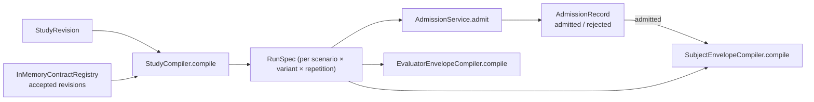

# Compilation and admission

`src/evidrun/contracts/compiler.py` turns accepted authoring revisions into executable specs and decides whether the active runtime can run them. It has four responsibilities:

1. resolve and hold accepted revisions (`InMemoryContractRegistry`);
2. expand a Study into RunSpecs (`StudyCompiler`);
3. decide admission per RunSpec (`AdmissionService`);
4. compile the disclosure envelopes (`SubjectEnvelopeCompiler`, `EvaluatorEnvelopeCompiler`).

## Key abstractions

| Type | Role |
| --- | --- |
| `ContractResolver` (Protocol) | Resolves a `ContractRef` to its `RevisionEnvelope`. |
| `InMemoryContractRegistry` | In-memory resolver enforcing immutability, monotonic revisions, and accepted-only resolution. |
| `ExtensionSchemaRegistry` / `ExtensionValidator` | Validates extension payloads against registered schemas. |
| `VariantDiffer` | Computes which typed slots differ between two RunSpecs. |
| `StudyCompiler` | Expands a Study into RunSpecs and validates comparisons. |
| `CapabilityCatalogEntry` / `ProviderCatalogEntry` | The runtime's registered capabilities and providers. |
| `AdmissionService` | Checks a RunSpec against the runtime and returns an `AdmissionRecord`. |
| `SubjectEnvelopeCompiler` | Builds the closed-allowlist `SubjectEnvelope`. |
| `EvaluatorEnvelopeCompiler` | Builds the per-stage `EvaluatorEnvelope`. |

## The contract registry

`InMemoryContractRegistry` stores revisions and decisions keyed by `(contract_type, logical_id, revision)`. It enforces the immutability and acceptance rules:

- `add` rejects a second revision with the same key but different content, and requires revisions to be monotonic (each new revision is exactly the previous max plus one).
- `decide` verifies a human attestation through the injected `HumanAttestationVerifier`, or, for a repository fixture, requires `allow_repository_fixture=True`. Only an accepted revision can be superseded, and a conflicting decision is rejected.
- `resolve` returns a revision only if the reference digest matches and the revision has an `accepted` decision. This is why the compiler can never pull in a draft or rejected contract.

The [database](../database.md) builds a registry from stored rows via `Repository.contract_registry`, replaying every decision through the same verifier.

## StudyCompiler

`compile(study)` resolves the Study ref (confirming it resolves to a `StudyRevision`), validates comparisons, then produces one RunSpec for every `(scenario_ref, variant, repetition_index)` combination.

`_materialize` is where a variant becomes a concrete spec. It starts from the run blueprint, applies `VariantOverrides` slot by slot (an override ref replaces the blueprint ref), resolves every ref through the registry with a type check (`_resolve_typed`), validates extensions, and assembles the `RunSpec`. It also checks that a progress-artifact `checkpoint_reached` trigger references a checkpoint definition that actually exists.

Seeds come from `_seed`: `deterministic` yields `0`, `fixed` yields the declared seed, and `per_repetition` yields `seed + repetition_index - 1`.

### Comparison validation

`_validate_comparisons` materializes the baseline and candidate variants for each comparison and diffs them with `VariantDiffer.changed_slots`. The rule depends on evidence mode:

- `prospective_controlled`: the changed slots must be exactly the comparison's primary variable — nothing more, nothing less. A controlled comparison that changes two things is rejected.
- `exploratory`: extra differences beyond the primary variable are allowed only if the candidate variant declares `confounders`.

`VariantDiffer` compares the same typed slots listed in `VARIANT_SLOTS`, pairing each ref with its resolved payload so a digest-identical change is not counted.

## AdmissionService

`AdmissionService` is constructed with the runtime's capabilities: registered `runners`, a capability catalog, providers, and the allowed workspace runtime kinds, interaction modes, runtime capabilities, network modes, and external-effect modes. Its defaults are deliberately minimal — `workspace_runtime_kinds=("in_process",)`, `interaction_modes=("single_turn",)`, `network_modes=("disabled",)`, `external_effect_modes=("denied",)`.

`admit(spec)` accumulates three collections — `missing_requirements`, `denied_policies`, and blocking `AdmissionIssue`s — plus non-blocking `warnings`, then returns an `AdmissionRecord`. The decision is `rejected` if anything blocks and `admitted` otherwise. The record's own validator re-derives `blocked` and refuses an inconsistent decision.

### What admission checks

| Check | Rejected when |
| --- | --- |
| Runner | The runner ref is not registered with a matching digest. |
| Provider | A named provider profile is not in the catalog. |
| Capabilities | A capability is unregistered, the interface version is unsupported, permissions exceed the allowlist, or authority constraints cannot be proven. Optional ones become warnings. |
| Runtime requirements | A required runtime capability is not implemented. |
| Input classification | Any input binding is `sensitive` or `restricted` — no classified materialization boundary exists. |
| Workspace | Runtime kind unsupported; a mount is not an exact subject-visible scenario input; any read-write mount; write zones, secrets, snapshots, or non-`discard` cleanup; network or external-effect mode not allowed. |
| Interaction | Mode not `single_turn`; or `max_turns != 1`, a system prompt ref, or initial message refs (single-turn materialization is unsupported). |
| Capture | `raw_encrypted` — no encrypted output sink. |
| Progress artifacts | Any policy present — no background observer. |
| Checkpoints | Any policy present — no checkpoint coordinator. |
| Goal | `bounded_exploration` — the runner emits only goal-state terminals. |
| Evaluation | Anything other than exactly one deterministic boolean grader triggered by `subject.responded` with an `expected` parameter. |
| Adjudication | `human_adjudication_policy.required` — verified human adjudication is not implemented. |
| Disclosure | Subject disclosure mode other than `none` — the runner receives objective and context only. |
| Budgets | Any token/tool/cost budget, or `max_turns` not in {None, 1}. |
| Stop conditions | Any stop that is not terminal `goal_complete`/`budget_exhausted`, or the absence of a terminal `budget_exhausted`. |

Each rejection is a specific `AdmissionIssue` with a `category`, `subject_ref`, and a `ResolutionReason` code (`unsupported`, `denied`, `unavailable`, `digest_mismatch`). This is the fail-closed boundary described in [systems](../index.md): the contracts can express far more than the runtime executes, and admission is where the gap is enforced. See [runspec and admission](../../primitives/runspec-and-admission.md).

The resolved capabilities and provider fields are gathered into a `ResolvedAgentInventory`, which becomes part of the record regardless of the decision.

## SubjectEnvelopeCompiler

`SubjectEnvelopeCompiler.compile(spec, admission, materialized_inputs=...)` builds the closed allowlist the Subject actually sees. It refuses to run for a rejected admission or a mismatched RunSpec digest.

The envelope is an allowlist, not a projection of the whole spec:

- only `subject` and `subject_and_evaluator` input bindings are included;
- a context-limited RunSpec (one with a `context_policy`) requires `materialized_inputs`, and those must match the declared visible inputs by id and preserve every authority metadata field (role, visibility, mount access, mount name, media type, classification);
- only `resolved` capabilities are exposed;
- the workspace is reduced to a `SubjectWorkspace` (runtime kind, mount names, write zones, network and effect modes);
- evaluation guidance is included only when disclosure mode is `pre_run`, and then only the public dimensions, with scale and anchors gated by the disclosure flags.

Because admission rejects any disclosure other than `none`, the guidance branch never fires in the current runtime, but the code path exists and is exercised by the compiler tests. See [run execution](../run-execution.md) for how the run executor supplies materialized inputs from the context snapshot.

## EvaluatorEnvelopeCompiler

`EvaluatorEnvelopeCompiler.compile(spec, stage_id)` builds the per-stage view for evaluation. It selects the named stage, gathers the dimensions that stage outputs, includes only `evaluator` and `subject_and_evaluator` input bindings, and carries the plan's hidden input refs and blinded fields. The run executor uses it to read the `expected` grader parameter and the output dimension id.

## Entry points for modification

- To make a rejected capability executable, add it to the `AdmissionService` catalog or allowed-mode sets and implement the matching runtime behavior. Loosening admission without the runtime would break the fail-closed guarantee.
- To change how a Study expands, edit `StudyCompiler._materialize` and keep `VariantDiffer._SLOTS` aligned with `VARIANT_SLOTS`.
- Envelope allowlists are security boundaries; adding a field means deciding explicitly whether the Subject or evaluator should see it.
