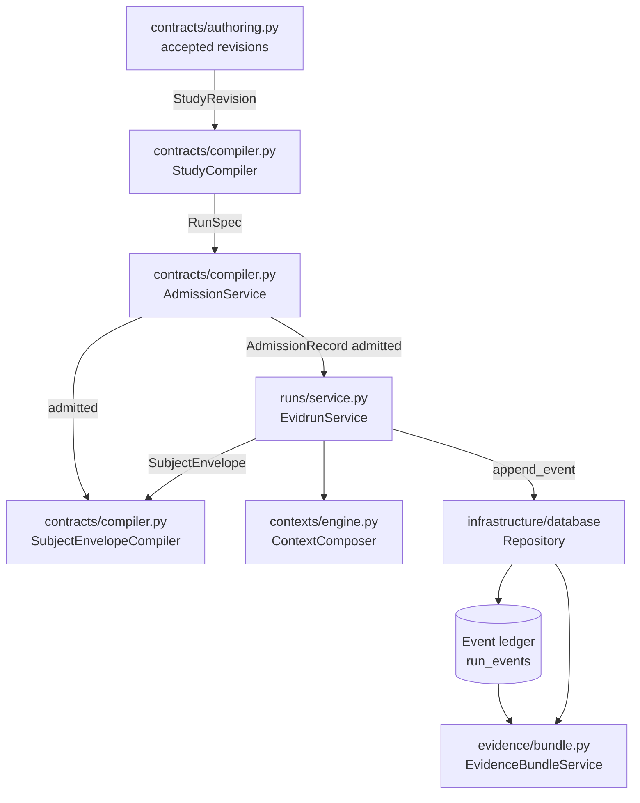

# Systems

This lens covers the internal building blocks of the Python domain core: the code that turns an accepted Study into an admitted Run, composes context, runs the deterministic subject, writes the append-only ledger, and exports auditable evidence. Where the [primitives](../primitives/index.md) lens describes the domain objects as concepts, this lens describes the modules that implement them.

Everything here lives under `src/evidrun/`. The domain never imports FastAPI, SQLAlchemy, OpenAI, Electron, or React; those dependencies stay behind ports in `src/evidrun/shared/ports.py` with adapters in `src/evidrun/infrastructure/`. See [architecture](../overview/architecture.md) for the three-plane picture.

## The systems

| System | Root | What it does |
| --- | --- | --- |
| [Contracts](contracts/index.md) | `src/evidrun/contracts/` | Frozen Pydantic models for authoring revisions, runtime records, compilation, and admission. The identity and rule layer everything else depends on. |
| [Run execution](run-execution.md) | `src/evidrun/runs/service.py` | Drives one RunSpec through admission, context composition, the subject runner, grading, and the terminal event. |
| [Context composition](context-composition.md) | `src/evidrun/contexts/` | Applies a context policy to source text, produces a hashed snapshot, and diffs two snapshots. |
| [Evidence](evidence.md) | `src/evidrun/evidence/bundle.py` | Exports v1 and v2 comparison bundles and verifies the event chain, contracts, and artifact manifest. |
| [Database](database.md) | `src/evidrun/infrastructure/database/` | SQLite/WAL persistence, the event-driven Run state machine, and hash-chained event append. |
| [Providers](providers.md) | `src/evidrun/providers/`, `src/evidrun/infrastructure/providers/` | The default provider profile and the OpenAI Responses adapter. Not used by the offline benchmark. |
| [Authority](authority.md) | `src/evidrun/authority/` | Human enrollment, challenge/confirmation, and WebAuthn attestation verification. Fails closed by default. |

## How they connect

The compiler resolves accepted revisions into one `RunSpec` per scenario/variant/repetition. Admission checks each RunSpec against the active runtime catalog and returns an `AdmissionRecord` that is either `admitted` or `rejected`. Only an admitted RunSpec can produce a Run, and only then does the run executor compose context, invoke the subject, grade the response, and drive lifecycle events into the ledger. The evidence service reads runs, specs, admissions, events, and records back out to build a verifiable bundle.

## The fail-closed boundary

The contract models are deliberately larger than what the runtime executes. A Study can express tools, skills, graph interaction protocols, checkpoints, progress artifacts, model-judge evaluation, human adjudication, non-`none` disclosure, and token/cost budgets. Admission rejects all of these today. The executable surface is:

- `single_turn` interaction, one turn, no materialized prompt artifacts
- `in_process` workspace, read-only mounts that are exact subject-visible scenario inputs
- `max_wall_seconds` budget only, with `goal_complete` and `budget_exhausted` terminal stops
- one deterministic boolean grader triggered by `subject.responded`
- a scripted deterministic subject runner

Every rejection is a specific entry in `missing_requirements`, `denied_policies`, or a blocking `AdmissionIssue`. See [compiler and admission](contracts/compiler.md) for the full list and [deterministic benchmark](../features/deterministic-benchmark.md) for the one flow that passes admission end to end.

## Entry points for modification

- To add a new contract field, start in [contracts](contracts/index.md) and follow the digest and envelope rules.
- To make a currently-rejected capability executable, change [admission](contracts/compiler.md) and the corresponding runtime code in [run execution](run-execution.md).
- To change how evidence is packaged or verified, see [evidence](evidence.md).
- To change persistence or the state machine, see [database](database.md).
