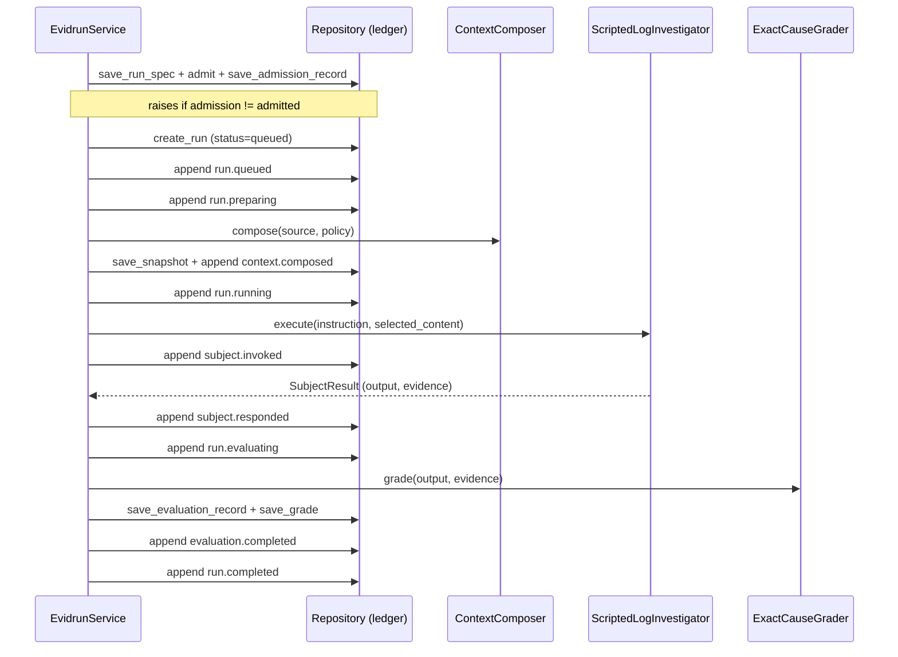

# Run execution

`src/evidrun/runs/service.py` holds `EvidrunService`, the orchestrator that drives a compiled RunSpec through admission, context composition, the deterministic subject, grading, and the append-only event ledger. It is the code behind the [deterministic benchmark](../features/deterministic-benchmark.md) and the closest thing Evidrun has to a run coordinator today.

## Purpose

`EvidrunService` wires together the pieces the other systems provide:

- the [context composer](context-composition.md) to apply a context policy;
- the `ScriptedLogInvestigator` subject runner (`src/evidrun/subject_runners/scripted.py`), a deterministic runner that greps a `ROOT_CAUSE=` marker out of the composed context;
- the [admission service](contracts/compiler.md) constructed with just the one registered runner;
- the `ExactCauseGrader` (`src/evidrun/evaluations/deterministic.py`), which passes only when the expected cause appears in both the output and the evidence;
- the [repository](database.md) for every write.

## Key source files

| File | Role |
| --- | --- |
| `src/evidrun/runs/service.py` | `EvidrunService.bootstrap_demo` and `_execute_spec`. |
| `src/evidrun/subject_runners/scripted.py` | `ScriptedLogInvestigator`, the deterministic subject. |
| `src/evidrun/evaluations/deterministic.py` | `ExactCauseGrader`. |
| `src/evidrun/contracts/legacy.py` | Imports the CRL-CTX-002 manifest as an accepted contract package. |

## bootstrap_demo

`bootstrap_demo(benchmark_root)` sets up and runs the whole CRL-CTX-002 comparison offline:

1. load the experiment manifest and the `long.log` fixture;
2. ensure a workspace and the "Context Reliability Lab" project exist via `latest_dashboard`;
3. save the experiment revision;
4. convert the manifest into a `LegacyStudyPackage` with `ExperimentManifestV1Adapter` and import it through `import_legacy_contract_package` (the only path that accepts a repository-fixture authority);
5. build a contract registry for the project and compile the Study into RunSpecs;
6. execute each spec with `_execute_spec`;
7. diff the baseline and candidate context snapshots and save a `Comparison` with a Portuguese report.

The result is a dict with the experiment revision id, study ref, comparison id, both run ids, the validity label, and the context diff.

## _execute_spec: the event sequence

`_execute_spec` runs one RunSpec and emits the full lifecycle. It requires a `context_policy` (the deterministic benchmark is context-driven), then walks these steps, appending an event at each phase. Every `append_event` call goes through the repository's state machine, which advances `RunRow.status` in the same transaction.

The ordered event types are: `run.queued`, `run.preparing`, `context.composed`, `run.running`, `subject.invoked`, `subject.responded`, `run.evaluating`, `evaluation.completed`, `run.completed`.

Note that `subject.invoked` is appended after `run.running` but the runner is awaited first; the response event follows. The subject is awaited under `asyncio.wait_for(..., timeout=spec.budgets.max_wall_seconds)`, which is how the wall-clock budget is enforced.

### Timeout and failure branches

- On `TimeoutError` (wall budget exceeded), the service appends `run.budget_exhausted` with a `not_assessable` goal result and re-raises. The timeout terminates the Run through the terminal event rather than being converted to `completed`.
- On any other exception from the runner, it appends `run.failed` with `not_assessable` and re-raises.

Both are terminal events, so no further events can be appended to that Run.

## Capture-mode handling

The RunSpec's `capture_policy.default_mode` decides what is actually stored:

- the stored context snapshot's `selected_content` is `[REDACTED]` for `redacted`, empty for `metadata`/`disabled`, and the real content otherwise;
- the `subject.responded` payload sets `output` to `[REDACTED]` only for `redacted` mode (otherwise `None`), includes raw evidence only for `raw_encrypted`, and includes scalar metadata unless the mode is `disabled`.

This matches the `SubjectRespondedPayload.validate_capture_shape` rules in [runtime records](contracts/runtime.md); the repository additionally checks that the payload's capture mode equals the RunSpec policy.

## Materialized subject input

Before invoking the subject, the service confirms exactly one visible subject input, then rebinds that input's `source` to an `ArtifactRef` naming the context snapshot (`context-snapshot:{id}`) with the snapshot content hash as digest. It passes this as `materialized_inputs` to `SubjectEnvelopeCompiler.compile`, satisfying the compiler's rule that a context-limited RunSpec must supply materialized inputs matching the declared visible inputs.

## Grader integration

After the response, the service compiles an `EvaluatorEnvelope` for the single evaluation stage, reads the `expected` parameter, and grades with `ExactCauseGrader`. It builds an `EvaluationRecord` (source `deterministic_grader`) whose boundary points at the `subject.responded` event's sequence and hash, with one boolean `DimensionValue` carrying an `event:` evidence ref. It saves the record and a legacy `Grade` row, appends `evaluation.completed` (which the repository checks against the persisted record), then `run.completed` with the evaluation ref and a goal state derived from whether the marker was visible and evidence was found.

## Comparison building

Back in `bootstrap_demo`, the baseline and candidate scores come from the grades, the context diff comes from `ContextComposer.diff` over the two snapshots, and `_build_report` renders a Markdown report that explicitly states the deterministic runner verifies infrastructure, not model ability. `save_comparison` persists it.

## Integration points

- [context composition](context-composition.md) supplies the snapshot and the diff.
- [contracts / compiler](contracts/compiler.md) supplies admission and both envelope compilers.
- [database](database.md) enforces the state machine and the per-event contract checks.
- [evidence](evidence.md) later exports and verifies the runs this service produced.

## Entry points for modification

- A real run coordinator would generalize `_execute_spec` beyond a single deterministic runner and single grader; the event sequence and capture handling are the template.
- Any new event must be emitted in the phase its `EVENT_ALLOWED_RUN_STATUSES` entry permits, or the repository will reject it.
- Budget enforcement beyond wall time requires both admission changes and new logic here.
